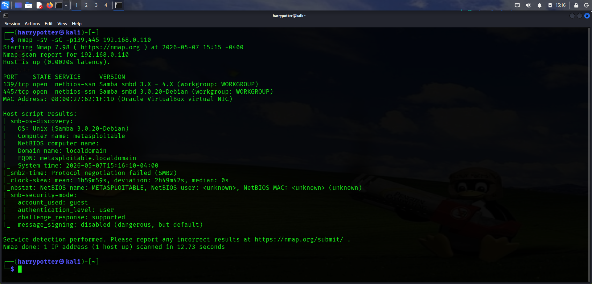
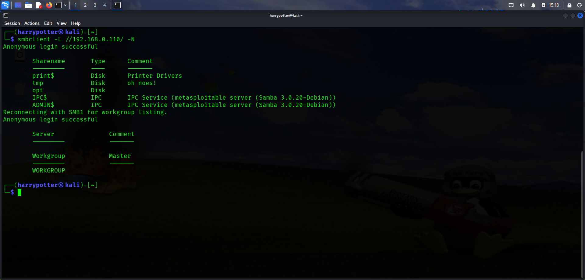
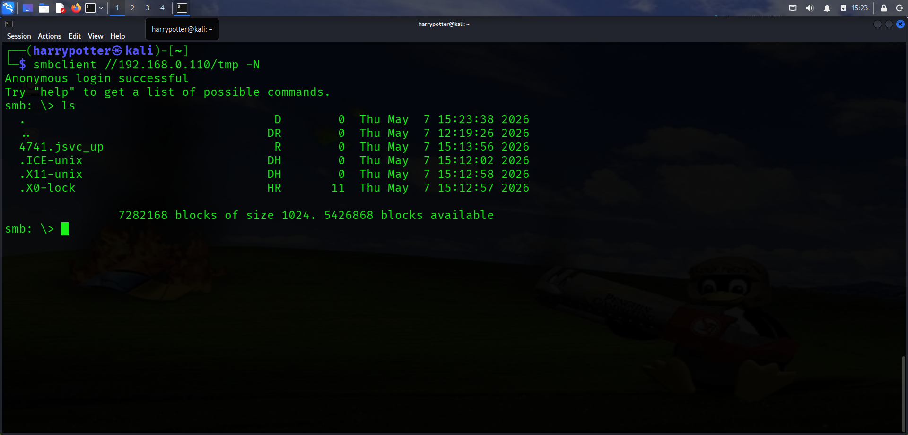
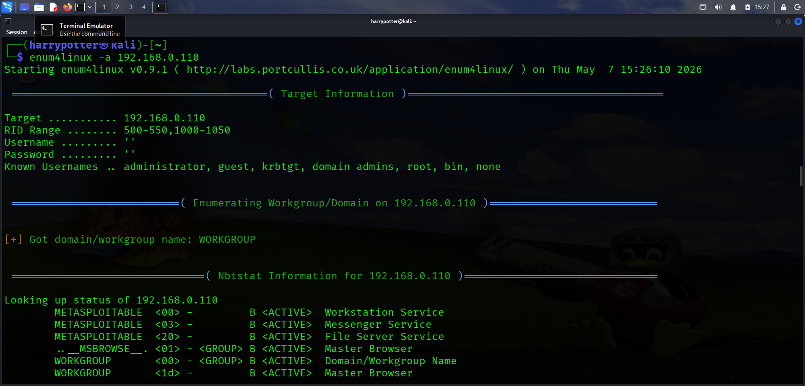
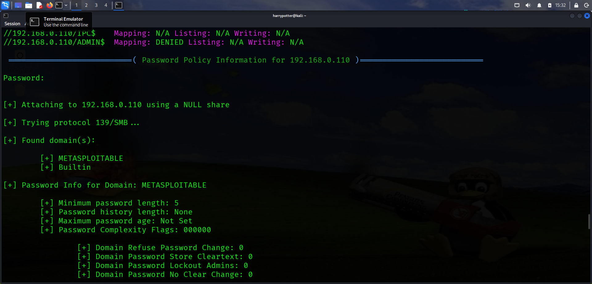
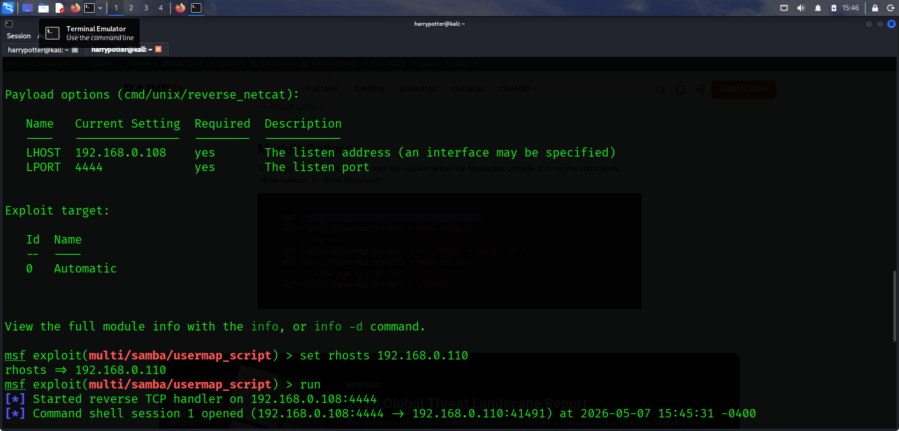

# SMB Enumeration & Exploitation

## Initial SMB Enumeration Using Nmap

```bash
nmap -sV -sC -p139,445 192.168.0.110
```

- Performed an initial SMB service enumeration scan against ports 139 and 445.
- Identified SMB/Samba service information and version details.
- Retrieved additional service information and SMB configuration details from the target system.


___

## SMB Share Enumeration Using smbclient

```bash
smbclient -L //192.168.0.110/ -N
```

- Enumerated available SMB shares using anonymous authentication.
- Identified accessible SMB shares exposed by the target system.


___

## Accessing SMB Share

```bash
smbclient //192.168.0.110/tmp -N
```

- Connected to the `tmp` SMB share using anonymous authentication.
- Verified that anonymous login access was enabled on the target system.
- Enumerated accessible files and directories inside the SMB share.


___

## SMB Enumeration Using enum4linux

```bash
enum4linux -a 192.168.0.110
```

- Performed detailed SMB enumeration using enum4linux.
- Retrieved:
  - Target information
  - RID ranges
  - Known usernames
  - Domain information
  - SMB service details

- Identified usernames such as:
  - administrator
  - guest
  - krbtgt
  - domain admins
  - root
  - bin


___

## Share Enumeration & Password Policy Analysis

- Enumerated SMB shares exposed by the target system including:
  - print$
  - tmp
  - opt
  - IPC$
  - ADMIN$

- Retrieved password policy information for the target domain.
- Identified:
  - Minimum password length
  - Account lockout settings
  - Password complexity configuration
  - Domain/workgroup information

- Identified the target running:
  - Samba 3.0.20-Debian


___

## SMB Exploitation Using Metasploit

```bash
msfconsole
```

- Researched publicly available Samba exploits.
- Identified a compatible exploit module for the detected Samba version.
- Configured exploit options including:
  - `RHOSTS`
  - `LHOST`

- Successfully executed the exploit against the target system and established remote access.


___

## Post Exploitation Enumeration

```bash
uname -a
hostname
pwd
```

- Performed basic post-exploitation enumeration after successful shell access.
- Retrieved:
  - Operating system information
  - Hostname details
  - Current working directory information


___


