# Simple_CTF - Enumeration & Exploitation

## Machine Information

- Target Machine: `Simple_CTF`
- Platform: :contentReference[oaicite:0]{index=0}
- Connected to the target environment using the TryHackMe OpenVPN configuration.

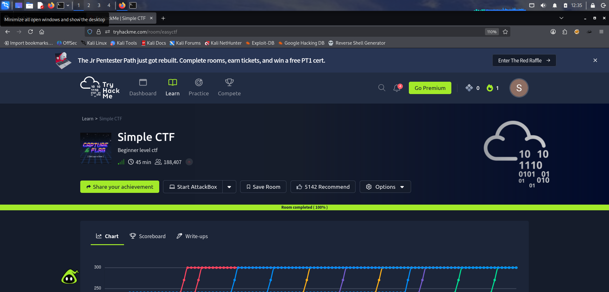

---

## Initial Nmap Scan

```bash
nmap -sV -sC 10.49.163.21
```

- Performed an initial service enumeration scan against the target system.
- Identified the following open ports and services:
  - FTP (21)
  - HTTP (80)
  - SSH (2222)


---

## Website Enumeration

```bash
http://10.49.163.21
```

- Accessed the target website through the HTTP service.
- Initial inspection of the webpage did not reveal useful information.

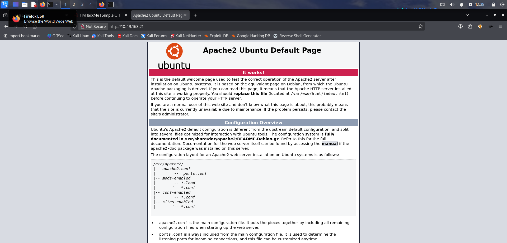

---

## Directory Enumeration Using DIRB

```bash
dirb http://10.49.163.21 -r
```

- Performed directory brute forcing against the web application using DIRB.
- Enumerated hidden directories and discovered a CMS-related page.

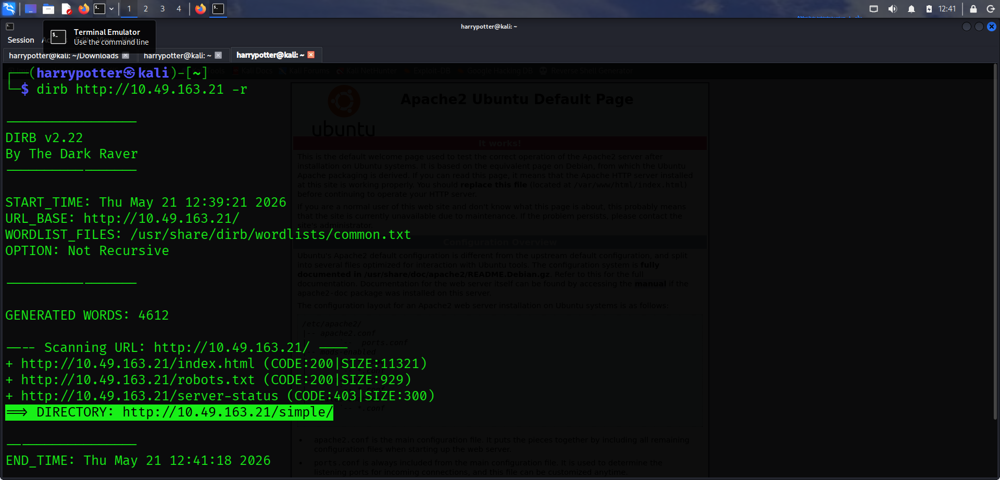

---

## CMS Identification

- Identified the CMS version from the discovered CMS page.
- Began researching publicly known vulnerabilities and CVEs related to the detected CMS version.

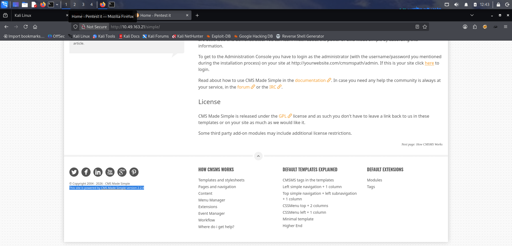

---

## Vulnerability Research

- Located a publicly available exploit for the identified CMS version through Exploit-DB.

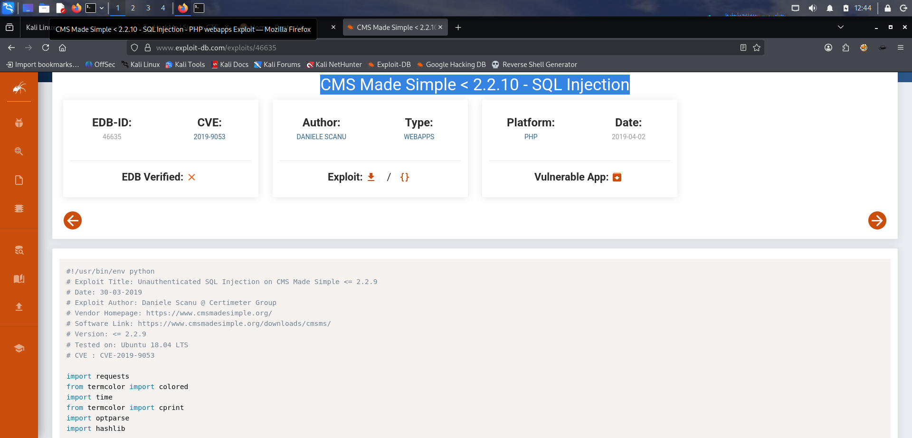

---

## Exploit Execution

- Created a Python exploit file named:
  - `export.py`

- Inserted the exploit code obtained from Exploit-DB.

```bash
python2 export.py -u http://10.49.163.21/simple
```

- Executed the exploit script against the target CMS.
- Faced compatibility issues due to differences between Python versions before successfully running the exploit.

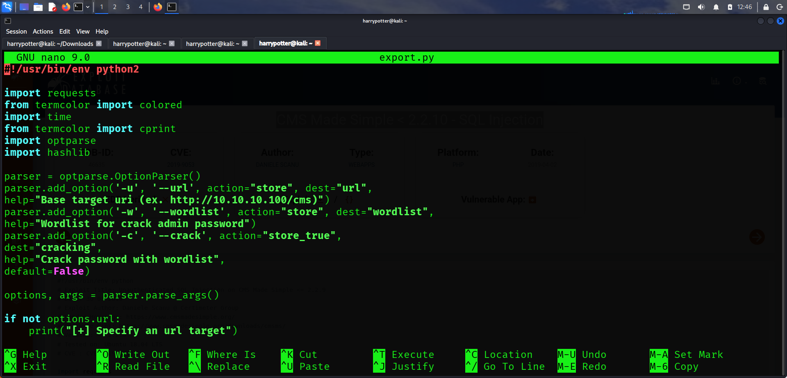

---

## Credential Discovery

- Successfully extracted:
  - Username
  - Password hash

from the vulnerable CMS instance.

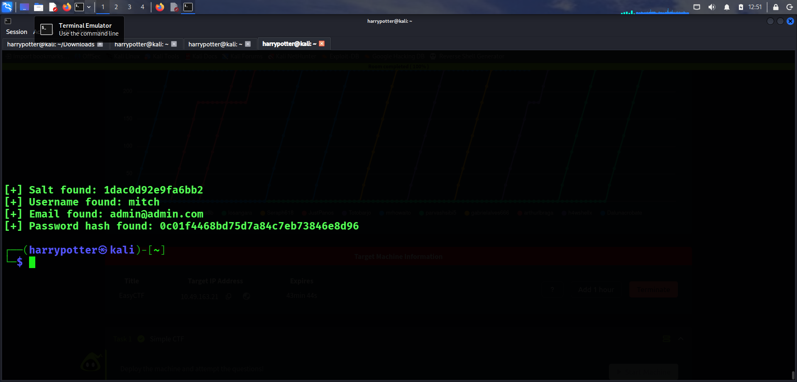

---

## Password Cracking

- Used an online hash cracking service to identify the plaintext password from the discovered password hash.

- Successfully obtained valid credentials for the target system.

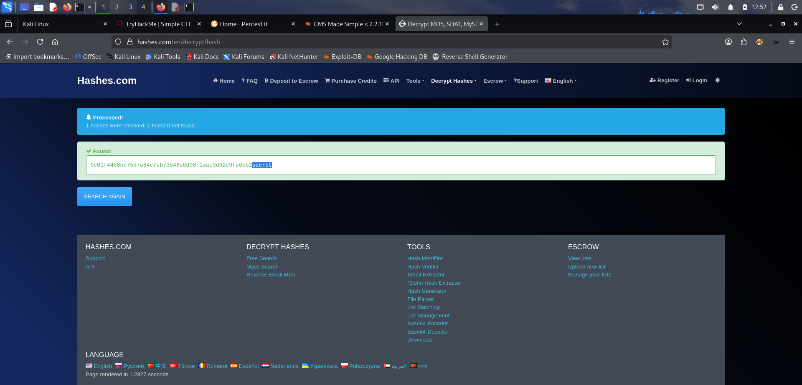

---

## SSH Access

```bash
ssh <USERNAME>@10.49.163.21 -p 2222
```

- Attempted authentication against the FTP service but was unsuccessful.
- Successfully authenticated to the SSH service using the discovered credentials.

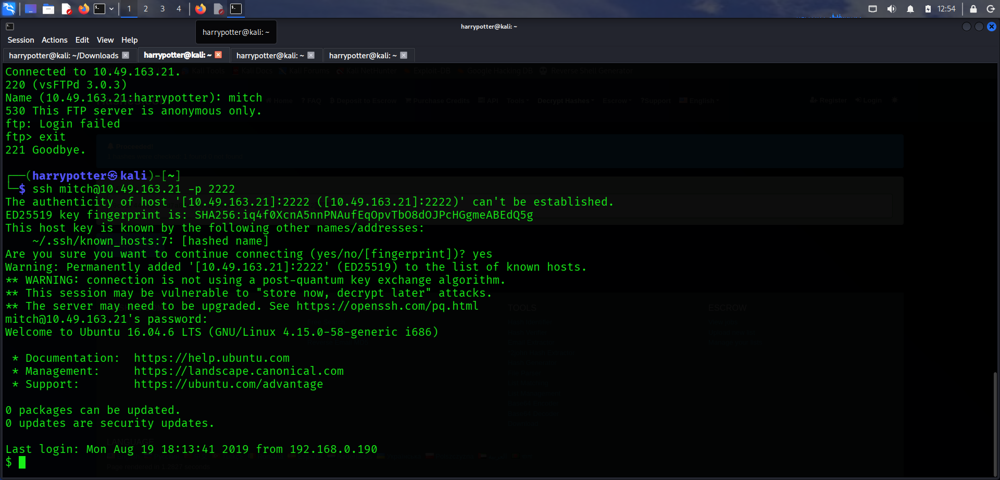

---

## Additional User Enumeration

```bash
ls /home
```

- Enumerated additional user accounts on the target system.
- Identified another user:
  - `sunbath`

- Attempted access to the user's files but lacked sufficient permissions.

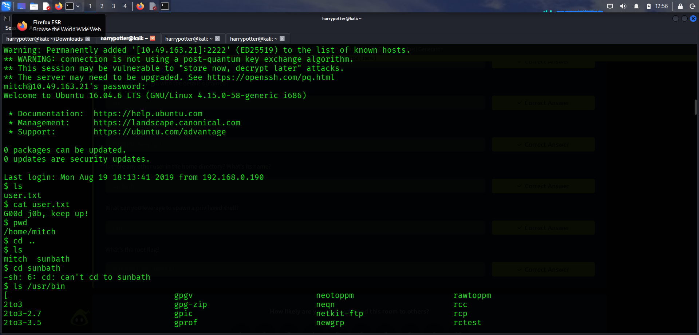

---

## Privilege Escalation

```bash
sudo -l
```

- Enumerated commands allowed through sudo privileges.
- Identified that the current user could execute:
  - `/usr/bin/vim`

with elevated privileges.

- Researched privilege escalation techniques using:
  - GTFOBins

- Executed the following command to spawn a root shell:

```bash
sudo vim -c ':!/bin/bash'
```

### Explanation

- `vim`
  - Text editor capable of executing shell commands.

- `:!/bin/bash`
  - Executes a Bash shell from within Vim.

- Since Vim was executable through sudo, the spawned shell inherited root privileges.

- Successfully obtained root access and retrieved the final flag from the root directory.

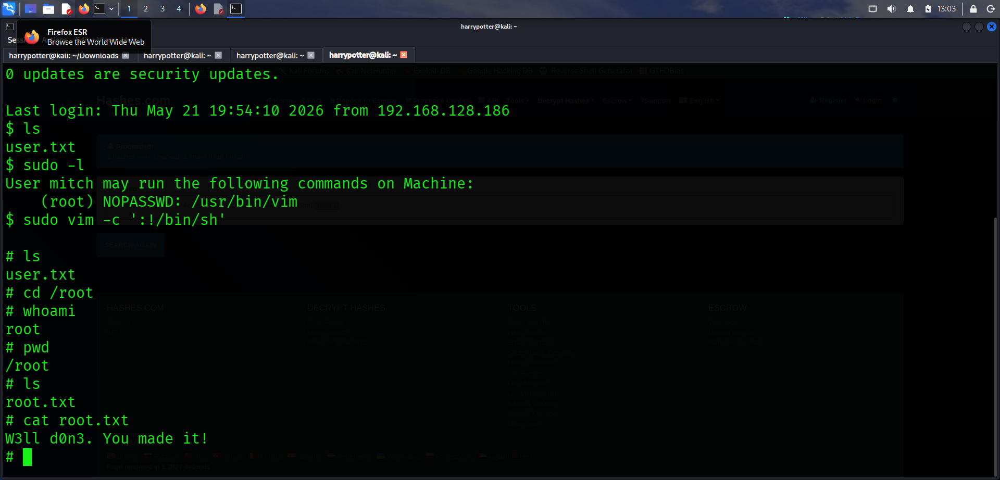
